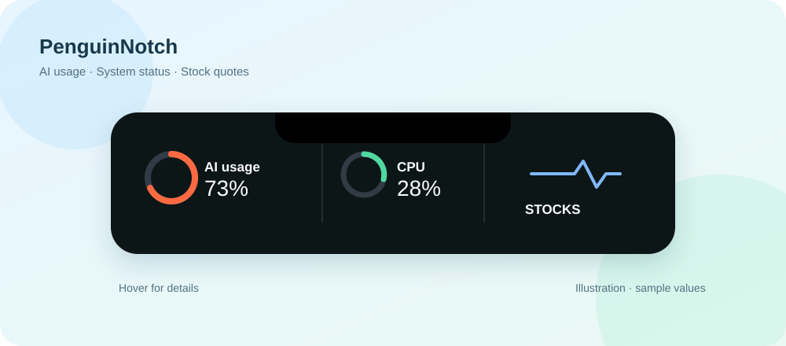
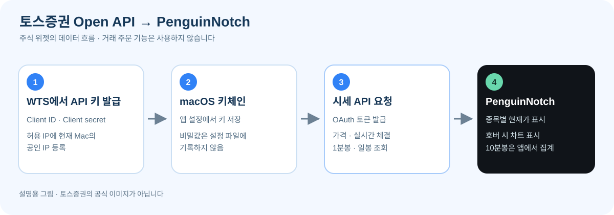

# PenguinNotch

[한국어](README.ko.md) · [English](README.md)

PenguinNotch는 화면 가장자리에 작은 노치를 띄워 AI 코딩 도구의 사용량과 작업 상태를 보여주는 앱입니다. macOS에서는 시스템 사용량, 날짜, 날씨, 오늘의 할 일과 주식 시세도 같은 노치에서 볼 수 있습니다. 항목별 표시 여부·순서·색상은 설정에서 바꿀 수 있습니다.



위 그림은 기능을 설명하기 위한 예시이며 실제 화면이나 실시간 값의 캡처는 아닙니다.

## 다운로드와 설치

- **macOS 15 이상:** [Releases](https://github.com/pmh10401/PenguinNotch/releases)에서 해당 커밋의 DMG를 받습니다. 현재 `preview` 빌드는 임시 서명된 시험용 빌드이며 Apple 공증을 거치지 않았습니다. 설치 후 macOS가 차단하면 **시스템 설정 → 개인정보 보호 및 보안**에서 해당 앱의 열기를 허용할 수 있습니다.
- **Windows:** [Windows Package 실행 결과](https://github.com/pmh10401/PenguinNotch/actions/workflows/windows-package.yml)에서 원하는 커밋의 설치 프로그램 아티팩트를 받습니다. 현재 설치 파일은 코드 서명되지 않아 SmartScreen 경고가 나올 수 있습니다. Windows판의 세부 기능과 설치 방법은 [Windows README](windows/README.md)를 참고하세요.

정식 서명 릴리스가 게시되면 [Releases](https://github.com/pmh10401/PenguinNotch/releases)의 파일을 우선 사용하세요. 시험용 빌드는 설치한 버전과 GitHub 커밋을 함께 확인하는 편이 좋습니다.

## 주요 기능

| 영역 | 표시 내용 |
| --- | --- |
| AI 도구 | Claude Code, Codex, Cursor, Grok 등 연결된 도구의 사용량·재설정 시간·진행/대기 상태. 도구별 사용 가능 정보는 다릅니다. |
| 시스템 | CPU·RAM·GPU·DISK·NET·BAT·PWR의 현재 값과 호버 상세 정보. CPU는 논리 코어별 부하도 볼 수 있습니다. 일부 GPU·전력 센서는 기기에서 값을 제공하지 않을 수 있습니다. |
| 일상 | 오늘 날짜와 월간 달력, 선택한 도시의 날씨, 오늘의 할 일. 날씨는 [Open-Meteo](https://open-meteo.com/en/docs)를 사용합니다. |
| 주식 (macOS) | 한국·미국 종목의 현재가, 실시간 체결 반영, 전일 종가 대비 변화, 호버 봉 차트. 토스증권 Open API 키가 필요합니다. |

노치 항목은 **설정 → Appearance → Notch items and order**에서 숨기거나 순서를 바꿉니다. 시스템 항목과 달력·날씨·할 일·주식은 각각 색상을 설정할 수 있습니다. 노치의 원형 표시와 막대 표시도 선택할 수 있습니다.

## 토스증권 Open API로 주식 시세 보기



위 그림은 PenguinNotch의 연동 구조를 설명하기 위해 직접 만든 그림이며 토스증권의 공식 이미지가 아닙니다. 앱은 **시세 조회 기능**을 사용하며 주문을 실행하지 않습니다.

1. 토스증권 WTS에 로그인하고 **설정 → Open API**에서 `Client ID`와 `Client secret`을 발급받습니다.
2. 같은 화면의 **허용 IP 관리**에 이 Mac이 인터넷에 접속할 때 사용하는 **공인 IP**를 등록합니다. 등록되지 않은 IP의 API 요청은 거부됩니다.
3. PenguinNotch의 **설정 → Appearance → Stocks**에 두 값을 입력하고 **Save API keys**를 누릅니다. 비밀값은 macOS 키체인에 보관하며 일반 설정 파일에는 저장하지 않습니다.
4. **Notch items and order**에서 **Stocks**를 켠 뒤, **Add symbol**에 한국 종목명·종목 코드(`005930`) 또는 미국 티커(`AAPL`, `SOXL`)를 입력합니다. 최대 30개까지 등록할 수 있습니다. 한국 상장기업명은 내장 목록에서 검색하며, 목록에 없는 ETF·우선주 등은 종목 코드를 직접 입력합니다.

앱은 `POST /oauth2/token`으로 인증한 다음 `GET /api/v1/prices`로 현재가를 한 번에 읽고, WebSocket 실시간 체결 메시지로 가격을 갱신합니다. 호버 차트는 `GET /api/v1/candles`의 **1분봉**과 **일봉**을 사용하며, **10분봉은 앱이 1분봉을 묶어 계산**합니다. 설정에서 1분봉·10분봉·일봉을 선택하고 표시할 봉 수를 **1~20개**로 정할 수 있습니다. 차트 요청은 종목별로 최대 10분에 한 번 갱신되며, 실시간 가격 갱신과는 별개입니다. 한 봉 조회가 실패해도 다른 봉 데이터가 있으면 그 차트는 계속 표시합니다.

토스증권 공식 문서: [Open API 시작하기](https://developers.tossinvest.com/) · [시세 및 캔들 API](https://developers.tossinvest.com/docs/market-data). 공식 API는 1분봉·일봉을 제공하며, 한 번에 최대 200개 봉을 반환할 수 있습니다. PenguinNotch는 화면에 최대 20개만 표시합니다.

시세가 보이지 않으면 먼저 API 키와 허용 IP를 확인하세요. 가격은 나오지만 차트가 없다면 해당 종목·봉의 API 응답이 없는지 확인해야 합니다. **Remove API keys**를 누르면 PenguinNotch가 저장한 토스 API 키를 키체인에서 삭제합니다.

## 그 밖의 사용 방법

- AI 사용량 원에 포인터를 올리면 제공자가 반환한 제한 기간, 재설정 시간, 계정·세션 정보를 볼 수 있습니다. 이용 가능한 정보가 없을 때 앱은 임의의 수치를 만들지 않고 상태를 표시합니다.
- CPU·메모리·네트워크 등 시스템 값은 약 1초마다 갱신됩니다. 네트워크 원은 Wi-Fi 신호를 나타내고, 유선 연결이면 가득 찬 원으로 표시됩니다. 개별 항목을 숨겨도 수집은 계속되며, **Enable system monitoring**을 끄면 전체 수집이 중지됩니다.
- 달력은 개인 일정을 읽지 않습니다. 날씨는 선택한 도시를 사용하며 기기 위치 권한이나 별도 API 키가 필요하지 않습니다. 오늘의 할 일은 이 Mac의 앱 설정에 저장됩니다.
- macOS 앱은 [Sparkle](https://sparkle-project.org)로 이 저장소의 서명된 업데이트 피드를 확인합니다. 자동 업데이트에는 서명된 릴리스와 `appcast.xml` 게시가 필요하며, 시험용 빌드만으로는 보장되지 않습니다.

AI 제공자별 데이터 출처, 상태 감지, 배치, 전력 측정의 한계 등 자세한 기술 설명은 [영어 README](README.md)에 있습니다.

## 소스에서 빌드

macOS에서는 Xcode와 `xcodegen`이 필요합니다.

```sh
brew install xcodegen
make run       # 프로젝트 생성, Debug 빌드 및 실행
make test-ci   # 서명 없이 단위 테스트
make install   # Release 빌드를 /Applications에 설치
```

Windows 빌드 절차는 [Windows README](windows/README.md)의 **Install / build**를 참고하세요. 개발용 앱은 배포 서명 앱과 키체인 접근 권한이 달라 비밀정보 접근 안내가 다시 나올 수 있습니다.

## 원본과 라이선스

PenguinNotch는 [vinzdg의 Codenotch](https://github.com/vinzdg/codenotch)를 기반으로 개발했습니다. 원본 저작권 표시와 MIT 라이선스는 [LICENSE](LICENSE)에 유지되어 있습니다. Windows판의 라이선스는 [windows/LICENSE](windows/LICENSE)를 참고하세요.
