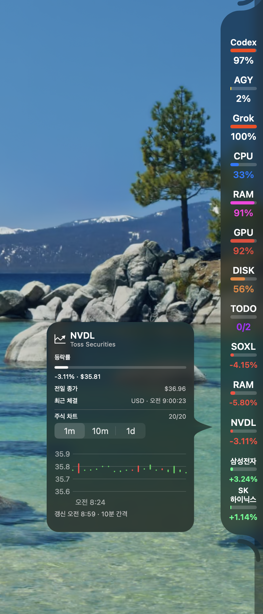
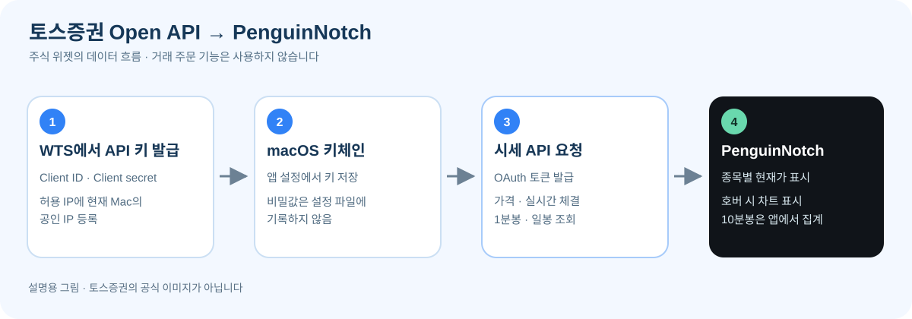

<div align="center">


한국어 · [English](README.md)

[](https://github.com/pmh10401/PenguinNotch/actions/workflows/ci.yml)


**PenguinNotch는 macOS 화면 가장자리에 작은 검은 노치를 띄워 코딩 도구별 사용 한도, 작업 진행 상태, 완료 및 사용자 입력 대기 상태를 보여주는 앱입니다.**

<a href="docs/design/penguinnotch-stocks.png"></a>

PenguinNotch의 화면 예시입니다. 사용량과 시세는 촬영 시점의 값이며 이미지를 누르면 원본 크기로 볼 수 있습니다.

</div>

사용량 원에 포인터를 올리면 한도 기간과 재설정 시각이 나옵니다. Claude 원의 **현재 세션**은 Claude Code의 `/usage`가 맨 앞에 보여주는 기간과 같습니다.

## 다운로드

[](../../releases/latest/download/PenguinNotch.dmg)

[최신 릴리스](../../releases/latest)의 `PenguinNotch.dmg`를 받습니다. 1.20.0은 임시 서명되며 **Apple 공증을 받지 않았습니다**. Sparkle 업데이트 서명은 파일의 출처를 검증하지만 Gatekeeper 경고를 없애지는 않습니다.

Xcode를 설치하지 않고 `main`의 개발 빌드를 시험하려면 커밋마다 다시 만들어지는 [preview 빌드](../../releases/tag/preview) 또는 [Package 작업](../../actions/workflows/package.yml)의 커밋별 DMG를 사용하세요. CI에는 Developer ID 인증서가 없어서 이 파일들은 임시 서명되며 Apple 공증을 받지 않습니다. 출처와 커밋을 확인한 뒤 앱을 `/Applications`로 옮겼다면 검역 속성을 한 번 제거할 수 있습니다.

```sh
xattr -dr com.apple.quarantine /Applications/PenguinNotch.app
```

이 빌드에서 macOS가 앱이 ‘손상되었다’고 표시하는 경우도 검역 속성 때문일 수 있습니다. 범용 바이너리이며 macOS 15 이상에서 동작합니다. 소스에서 설치하려면 [빌드](#빌드)를 참고하세요.

## Windows

[](../../releases/latest/download/PenguinNotch-Setup.exe)

Rust/Tauri 2 기반 Windows판은 [`windows/`](windows/README.md)에 있습니다. [최신 릴리스](../../releases/latest)에서 `PenguinNotch-Setup.exe`를 받습니다. 현재 사용자 계정에 관리자 권한 없이 설치하며, WebView2가 없으면 가져옵니다.

1.19.0에서는 토스/Finnhub 설정·시세·차트·기술적 분석·선택적 보유 종목 예측·영구 기록을 추가했습니다. 마운트된 볼륨별 디스크 용량, 논리 코어별 CPU 부하, 지원되는 GPU 엔진 사용률, Wi-Fi 신호 강도도 표시합니다.

설치 파일에 코드 서명이 없어 처음 실행할 때 SmartScreen의 **Windows의 PC 보호** 경고가 나올 수 있습니다. 출처를 확인한 뒤 **추가 정보 → 실행**을 선택하세요. Windows 변경마다 [Windows Package 작업](../../actions/workflows/windows-package.yml)에 설치 프로그램이 남습니다.

## 휴대전화 연결

iOS·Android 동반 앱은 Mac 노치에 보이는 사용률, 재설정 시간, 세션 상태를 표시할 수 있습니다. 토큰·인증 정보·원본 API 응답은 전달하지 않고 노치에 이미 표시된 정보만 읽습니다.

Mac에서 **Settings › Phone › Connect a Phone…** 또는 메뉴 항목을 열면 5분 제한의 QR 코드가 나옵니다. 휴대전화 앱으로 스캔하거나 링크를 복사해 앱에 붙여 넣으세요. 두 기기는 같은 Wi-Fi 네트워크에 있어야 하며, Mac의 서버는 로컬 네트워크 주소에만 응답하고 인터넷을 통한 접근을 거부합니다.

연결 코드는 한 번만 사용할 수 있고 5분 뒤 만료됩니다. 연결 창을 다시 열면 새 코드가 만들어집니다. 연결을 해제하려면 **Settings › Phone**의 기기 목록에서 **Remove**를 누르세요. 해당 기기의 인증 정보가 즉시 삭제되고 이후 요청도 거부됩니다. 상세 프로토콜은 [휴대전화 연결 문서](docs/phone-link-protocol.md)에 있습니다.

## 사용량 데이터 출처

| 제공자 | 분류 | 읽는 정보 |
| --- | --- | --- |
| **Claude Code** | 공식 데이터 | 같은 계정으로 로그인한 Claude Desktop의 사용량 캐시를 먼저 사용하고, 설치된 `claude`의 `/usage`, 로그인 키체인의 OAuth 토큰 순으로 확인합니다. |
| **Cursor** | 공식 데이터 | 편집기의 로컬 SQLite 로그인 상태 또는 키체인의 `cursor-agent` 로그인. 별도 로그인이 필요하지 않습니다. |
| **Codex** | 공식 데이터 | 로컬 Codex 로그인. 가능하면 5시간·주간 한도와 계정에서 제공하는 추가 기간을 표시합니다. |
| **DeepSeek Platform** | 공식 응답에서 계산 | PenguinNotch 자체 WKWebView에 명시적으로 로그인한 뒤 Platform 계정 요약과 API 키·모델 사용량을 읽어 충전/소비 잔액, 최근 30일 토큰·비용, 요청 수, API 키 수를 표시합니다. |
| **Antigravity** | 사용 가능한 공식 데이터 또는 요청 수 | 로컬 language server와 Google 할당량 응답을 차례로 사용하며, 둘 다 제공되지 않으면 단순 요청 수를 표시합니다. |
| **GLM** | 공식 데이터 | Claude Code의 `settings.json`, ZCode, OpenCode 중 이미 보유한 키로 Z.ai Coding Plan 모니터 엔드포인트를 읽습니다. |
| **MiniMax** | Coding Plan은 공식 데이터, 앱 로그인은 공식 응답에서 계산 | 설정에 붙여 넣은 Coding Plan 키 또는 앱 자체 WKWebView에서의 명시적 로그인. |
| **QianwenAI** | 공식 콘솔 응답에서 계산 | 앱 자체 WKWebView에 명시적으로 로그인한 뒤 Token Plan 게이트웨이에서 개인 요금제의 7일 크레딧 기간을 읽습니다. |
| **Ollama (Local)** | 로컬 런타임 | 로컬 모델, RAM/VRAM, 언로드 시간, 컨텍스트를 자동 감지합니다. 선택적 응답 캡처로 추론 상태와 생성 속도도 확인할 수 있습니다. |
| **LM Studio** | 로컬 런타임 | SDK 소켓에서 로드된 모델의 작업 상태를, 서버 로그에서 속도·컨텍스트·일일 토큰을 읽습니다. 별도 릴레이는 필요하지 않습니다. |
| **Grok** | 공식 데이터 | `~/.grok/auth.json`의 Grok CLI 세션으로 CLI `/usage`가 사용하는 크레딧 청구 엔드포인트를 읽습니다. |
| **OpenCode** | 공식 데이터 | OpenCode가 로그인할 때 저장한 `opencode-go` 키로 Go 요금제의 공식 사용량을 읽습니다. |
| **Command Code** | 공식 데이터 | `~/.commandcode/auth.json`에 저장된 키로 GOAT 요금제의 `/alpha` 청구 엔드포인트를 읽습니다. |
| **GitHub Copilot** | 공식 데이터 | Mac의 GitHub CLI 로그인(`gh auth login`)으로 Copilot 할당량 엔드포인트를 읽습니다. |
| **Kimi** | 공식 데이터 | `~/.kimi-code/credentials/kimi-code.json`의 Kimi Code CLI 세션으로 CLI `/usage`와 같은 `/usages`를 읽어 5시간·주간 한도를 표시합니다. |
| **Kiro** | 공식 데이터 | 이 Mac의 `kiro-cli` 세션으로 `/usage`를 읽어 월간 크레딧을 표시합니다. |
| **Amp** | 구독은 공식 비율, 무료 사용량은 계산값 | `~/.local/share/amp/secrets.json`의 Amp CLI 로그인으로 `userDisplayBalanceInfo`를 읽어 Agent·Orb 사용량 또는 무료 허용량과 보충 속도를 표시합니다. [Amp 설명](docs/providers/amp.md) 참고. |

대부분의 제공자는 Mac에 이미 설치된 도구의 세션 또는 인증 정보를 빌려 씁니다. DeepSeek는 예외로, **Sign in to DeepSeek**를 선택한 뒤 앱 자체 WKWebView에서만 로그인합니다. 브라우저의 쿠키나 인증 정보를 읽지 않습니다. MiniMax도 설정에 키를 입력하거나 자체 WKWebView에서 명시적으로 로그인합니다. QianwenAI는 공개 사용량 API와 입력 가능한 키가 없어 자체 WKWebView 로그인만 사용합니다. 이 셋은 브라우저의 쿠키 저장소를 열지 않습니다.

Ollama Cloud 키는 설정에 입력할 수 있습니다. 제공자를 끄면 사용량 조회를 멈추고 읽어 둔 값을 지우지만, 원래 도구에 로그인한 계정은 그대로 둡니다.

**로컬 Ollama는 자동 감지**됩니다. **Settings → Ollama**에서 주소를 바꾸거나 감시를 끌 수 있습니다. 로드된 모델마다 노치 항목이 생기며 **Settings → AI subscriptions**에서 순서를 바꾸거나 숨길 수 있습니다. 호버하면 RAM/VRAM, 언로드 시각, 컨텍스트 한도, 양자화 정보가 나옵니다.

생성 속도(**tok/s**)와 실시간 **Thinking**을 보려면 Settings → Ollama의 **Measure speed and thinking**을 켜고 PenguinNotch를 실행한 상태로 로컬 릴레이에 연결하세요.

```sh
OLLAMA_HOST=http://127.0.0.1:11435 ollama run gemma4:e4b --think
```

속도는 완료된 Ollama 기본 응답에서 갱신되며, Thinking은 스트리밍 추론 응답이 필요합니다. Ollama 기본 포트(`11434`)에 직접 요청하면 모델 감지만 됩니다. 감시는 추론을 시작하지 않고 프롬프트·추론·답변도 저장하지 않습니다. [Ollama 설명](docs/plans/2026-09-07-local-llm-provider-plan.md)을 참고하세요.

**로컬 LM Studio도 자동 감지**됩니다. 기본 포트는 1234이며, 변경했다면 **Settings → LM Studio**에서 주소를 지정하거나 감시를 끌 수 있습니다. 로드된 언어 모델마다 노치 항목이 생기고 임베딩 모델은 제외됩니다. 항목에는 마지막 응답 속도(**tok/s**)와 컨텍스트 사용 비율이 표시됩니다. 프롬프트 처리·생성 중에는 흰 원호가 돌고, 요청 대기 중에는 점 모양 원이 나타납니다. 호버하면 컨텍스트 사용량, 오늘의 토큰·요청 수, 추론 비율, speculative decoding 수용률, 모델 크기·양자화·컨텍스트 한도를 볼 수 있습니다.

LM Studio를 PenguinNotch로 연결할 필요는 없습니다. 작업 상태는 `lms ps`가 쓰는 포트의 SDK 소켓에서, 속도와 토큰 수는 모든 클라이언트 요청에 대해 작성되는 `~/.lmstudio/server-logs`에서 읽습니다. 프롬프트와 응답 본문은 읽지 않고 수치와 시간만 사용합니다. OpenAI 호환 엔드포인트 응답에는 시계 정보가 없어 생성 단계부터 속도를 계산하고 `~`를 붙입니다. 서버가 API 토큰을 요구하면 Settings → LM Studio에 붙여 넣거나 `LM_API_TOKEN`을 설정하세요. 그렇지 않으면 Authorization 헤더를 보내지 않습니다. [LM Studio 설명](docs/plans/2026-09-10-lm-studio-provider-plan.md)을 참고하세요.

설정은 연결된 제공자를 노치 표시 순서대로 보여줍니다. 드래그 손잡이로 옮긴 순서는 재실행 후에도 유지됩니다. 제공자를 껐다 다시 켜면 예전 위치를 차지하지 않고 목록 끝에 추가됩니다.

노치는 **지금도 작업 중인가?**에도 답합니다. 세션이 바쁘면 원 안의 얇은 원호가 돌고, 사용자 입력을 기다리면 주황색 원이 맥동합니다. 호버하면 각 실시간 세션의 이름, 실행 위치, 요청 내용을 볼 수 있습니다.

Claude Code 로그인 두 개는 원도 두 개입니다. `CLAUDE_CONFIG_DIR=~/.claude-work claude`처럼 업무용 계정을 분리하면 개인용 옆에 **Claude (work)**가 자체 한도·세션·설정 행으로 나타납니다. 앱을 시작할 때 사용된 `~/.claude-<slug>` 디렉터리를 찾고, 기본 `~/.claude`를 먼저, 나머지를 알파벳순으로 표시해 순서가 바뀌지 않게 합니다.

Codex도 기본 `~/.codex`는 **Codex**, 사용된 `~/.codex-<slug>`는 **Codex (slug)**로 각각 한도·활동·설정 행을 가집니다. 두 번째 계정은 별도 디렉터리로 Codex CLI에 로그인하세요.

```sh
mkdir -p "$HOME/.codex-work"
CODEX_HOME="$HOME/.codex-work" codex -c 'cli_auth_credentials_store="file"' login
```

로그인할 때 다른 계정을 선택한 뒤 PenguinNotch를 다시 시작합니다. 해당 계정의 CLI도 `CODEX_HOME="$HOME/.codex-work" codex`로 실행하세요. `.codex-personal`처럼 이름을 추가해 계정을 늘릴 수 있습니다. 설정에는 계정 이메일과 프로필 경로가 보이며 원마다 순서를 바꾸거나 끌 수 있습니다. 하나를 꺼도 Codex 로그인 자체는 유지됩니다.

PenguinNotch는 각 프로필의 `auth.json`을 읽습니다. 키체인 전용 또는 API 키 전용 로그인에서는 ChatGPT 계정 한도를 알 수 없습니다. Codex 인증 정보를 복사·갱신·수정하지 않으며, 로그인이 만료되면 해당 프로필의 Codex CLI로 갱신해야 합니다. `~/.codex-<slug>` 규칙 밖의 디렉터리는 자동 발견하지 않고, Claude와 마찬가지로 프로필 추가 후 앱을 다시 시작해야 합니다.

## 세션이 끝날 때

에이전트의 작업이 끝나거나 질문으로 멈추면 노치가 5초간 펼쳐지고 소리가 납니다. 펼쳐진 노치를 클릭하면 해당 세션의 **앱**을 앞으로 가져옵니다.

탭까지 선택하지는 않습니다. 세션이 제공하는 정보는 PID뿐이고 창·탭·TTY 정보는 없어서, 에이전트 프로세스의 상위 프로세스를 따라 실행 앱을 찾습니다. 특정 탭을 고르려면 터미널별 스크립팅 인터페이스가 필요한데 Terminal.app과 iTerm2는 TTY로 찾을 수 있어도 Warp와 Ghostty는 공통 스크립팅 인터페이스를 제공하지 않습니다. 그래서 모든 터미널에서 앱을 앞으로 가져오고 툴팁에 세션 이름을 보여줍니다.

펼치기와 소리는 설정에서 따로 끌 수 있습니다. 전체 화면 뒤에서는 펼치기가 소용없고 회의 중에는 소리가 곤란할 수 있기 때문입니다. 완료와 사용자 입력 대기 이벤트마다 별도 소리를 고르고 미리 들어볼 수도 있습니다. 소리는 `NSSound` 시스템 알림이 아니라 일반 오디오 출력으로 재생합니다. macOS의 인터페이스 효과음 채널이 꺼져 있으면 `NSSound.play()`는 성공해도 소리가 나지 않을 수 있기 때문입니다.

바쁜 상태에서 **벗어날 때만** 알립니다. 질문에 답하는 것은 작업 종료로 보지 않습니다. Claude Code 종료처럼 세션 파일이 작업 중 사라지면 돌아갈 창이 없어 알리지 않습니다. 앱 시작 시 처음 발견한 기존 세션도 이전 상태를 모르므로 알리지 않습니다.

## 알림

제공자의 대표 한도가 **80%를 넘거나 100%에 도달**하면 시스템 알림을 보냅니다. 같은 상태에서는 반복하지 않고 한도 기간이 실제로 바뀐 뒤에만 다시 보냅니다. 제공자별 설정 행에서 음소거할 수 있으며, macOS 알림 권한은 실행 직후가 아니라 첫 실제 알림에서 요청합니다.

## 목적별 설정

항목이 많아 화면을 넘으면 노치 위에서 **마우스 휠이나 트랙패드**로 나머지 항목을 볼 수 있습니다. macOS와 Windows의 네 방향·원형·막대 표시에서 사용할 수 있으며, 위·아래 노치는 세로 휠로도 좌우로 스크롤됩니다. 호버 카드의 스크롤은 별도로 동작하고, 모든 항목이 들어가면 노치는 움직이지 않습니다.

**설정 → 모양 → 호버 글자 크기**에서 호버 카드를 **80~150%**로 조절할 수 있습니다(기본 **100%**).
macOS와 Windows 모두 글자와 버튼이 함께 커지며, 화면보다 긴 카드는 스크롤됩니다.
이 설정은 노치 크기와 별도로 저장됩니다.

macOS 사이드바를 **AI 구독**, **주식**, **컴퓨터 모니터링**, **생활 위젯**, **모양**으로 나눴습니다. 주식·컴퓨터 모니터링·생활 위젯의 표시 여부와 색상은 각 페이지에서 바꿉니다. 주식 페이지는 시세 제공처 하나를 먼저 고르며 API 키는 필요할 때 펼칩니다. AI 사용량 표시 형식과 한도 기준은 AI 계정과 함께 관리합니다. 앱 언어, 강조색, Dock·메뉴 막대 설정은 **일반**에 있습니다.

**모양 → 노치 항목과 순서 → 표시 항목과 순서 편집**에서 카테고리로 목록을 좁히거나 **카테고리별로 모으기**를 눌러 관련 항목을 모을 수 있습니다. 필터링한 목록의 순서를 바꿔도 다른 카테고리의 위치는 유지하며, 기존 표시 여부·색상·순서도 보존합니다.

## 노치 위치와 모양

노치는 화면 네 가장자리 어디에나 놓을 수 있습니다. 좌우에서는 세로 열, 상하에서는 가로 행으로 표시합니다. 화면의 물리적 가장자리에 고정되므로 Dock을 보이거나 숨겨도 움직이지 않습니다. **Option(⌥)을 누른 채 드래그**하면 같은 가장자리에서 위치를 옮길 수 있고, 위치는 가장자리별로 기억됩니다. 하드웨어 노치가 있는 Mac에서 화면 위쪽에 놓으면 그 형태에 맞춥니다. **Settings → Appearance → Recentre**는 현재 가장자리의 위치를 중앙으로 되돌립니다.

macOS에서 같은 설정의 **Size**는 노치의 원과 글자 크기를 조절하며, 호버 카드는 별도의 크기 설정을 유지합니다. Medium이 기본 설계 크기입니다. 평소에는 화면 가장자리의 작은 캡슐 형태로 있다가 포인터를 가져가면 펼쳐집니다. 설정에서 항상 표시하거나 완전히 숨길 수도 있습니다. 노치 아래의 작은 구체에 포인터를 올리면 설정 톱니바퀴가 나옵니다.

Windows에서는 **모양 → 지금 노치 표시** 또는 트레이 메뉴의 **지금 노치 표시**를 누르면 숨긴 노치도 저장된 위치에 나타납니다. 호버 모드는 5초 동안 펼쳐집니다. **미터 모양**에서 전체 항목을 원형·막대로 바꾸고, **크기 → 사용자 지정**에서 노치 전체를 **75~150%**로 조절합니다. 사용자 지정 값은 기본 크기·호버 글자 크기와 별도로 기억합니다. **가운데로 되돌리기**는 선택한 디스플레이와 다른 가장자리의 위치를 유지합니다. 디스플레이가 분리되면 임시로 주 화면을 사용하며 다시 연결하면 저장된 디스플레이로 돌아갑니다.

펼쳐진 노치 **본체**를 클릭하면 열린 상태로 고정되고 다시 클릭하면 풀립니다. 원을 클릭하면 해당 제공자를 새로 읽고 구체를 클릭하면 설정이 열리므로, 고정은 본체를 클릭해야 합니다. 우클릭 메뉴의 **Keep open**에서도 고정 상태를 확인하거나 해제할 수 있습니다. 설정이 Always show일 때는 이 메뉴가 비활성화됩니다.

**Settings → AI subscriptions → Usage display → Reset time**에서는 `Resets in 3 Days 3h`처럼 남은 시간을 세거나 재설정 날짜·시간을 표시할 수 있습니다. 1시간 미만이면 분도 보입니다. 강조색은 기기 색상이 기본이며 분홍·빨강·주황·노랑·초록·청록·파랑·남색·보라·미색 프리셋을 선택할 수 있습니다.

앱 아이콘은 Dock, 메뉴 막대, 둘 다 또는 둘 다 아닌 형태로 표시할 수 있습니다. **Settings → General → App → Show limit information in menu bar**를 켜면 선택한 제공자의 5시간 한도를 표식·사용률·재설정까지 남은 시간으로 표시합니다. 예: `72% · 2h 18m | 41% · 4h 05m`. 아무 제공자도 선택하지 않으면 아이콘만 남고, 메뉴에는 어느 경우든 전체 읽기 값이 나옵니다. 메뉴 표시 선택은 수집 대상에 영향을 주지 않습니다.

## 시스템 사용량 (로컬 개발)

macOS와 Windows 노치는 **CPU, RAM, GPU, DISK, NET, BAT, PWR** 일곱 항목을 약 1초마다 갱신합니다. macOS에서는 **Settings → Computer monitoring**에서 전체 수집을 끌 수 있습니다. AI 계정을 연결하지 않아도 동작하며 한도 알림이나 사용량 기록 보관 대상이 아닙니다.

같은 설정에서 항목별 색상을 지정할 수 있습니다. 이 색상은 사용률과 무관하게 원호·이름·값·툴팁 막대에 적용되고, 되돌리기 화살표는 자동 색상으로 복원합니다. NET 원호는 주 연결 상태를, 글자는 전송 속도를 보여줍니다. PWR에는 백분율 원호가 없습니다. BAT의 자동 색상은 높은 사용량이 아니라 배터리 잔량 부족을 경고합니다.

아래 센서별 상세 설명은 macOS 기준입니다. Windows에서는 **설정 → 시스템**에서 제어하며 PDH로 논리 코어별 CPU 부하와 지원되는 GPU 엔진 사용률을 읽습니다. GPU 대표값은 가장 바쁜 엔진입니다. DISK는 마운트된 로컬 고정·이동식 볼륨을 중복 없이 합산하고 파티션·폴더 마운트별 용량을 호버에 표시하며 30초마다 갱신합니다. NET은 Windows WLAN 신호 품질로 Wi-Fi 원호를 표시하고 유선은 원을 채우며 Windows Wi-Fi 설정을 엽니다. 센서값을 읽지 못하면 `—`로 표시합니다. Windows PWR은 배터리 방전 추정치로, Mac의 전체 시스템 소비 전력과 측정 대상이 다릅니다.

- **CPU:** 두 표본 사이 전체 논리 코어의 바쁜 틱 비율(0~100%)입니다. 호버하면 사용자/시스템 비중, 논리 코어 수, macOS 열 압력, 가동 시간을 볼 수 있습니다. 스크롤 가능한 2열 격자에는 같은 간격의 Mach 프로세서 틱으로 구한 논리 코어별 부하가 1번부터 나옵니다. 처음 표본, 읽기 실패, 긴 공백은 0%로 꾸미지 않습니다.
- **RAM:** 파일 캐시를 제외하고 익명 메모리에서 정리 가능한 페이지를 뺀 값에 wired 메모리와 압축기 사용량을 더합니다. 호버하면 사용/전체 용량, wired·압축 메모리, 스왑 사용량이 나옵니다. 이 크기는 메모리 압력 지표가 아닙니다.
- **GPU:** 가장 바쁜 가속기의 드라이버 제공 `Device Utilization %`입니다. 문서화되지 않은 IOKit 값이어서 기기나 macOS 버전에 따라 없을 수 있고, 그때는 0%가 아니라 `—`를 표시합니다. 드라이버가 제공한다면 같은 가속기의 렌더러·타일러 활동 및 사용 중 GPU 메모리도 나옵니다. 이들은 엔진 수치이며 GPU 코어별 부하는 제공하지 않습니다.
- **DISK:** 홈 디렉터리가 있는 볼륨의 전체 용량에서 현재 사용 가능 용량을 뺀 값입니다. APFS의 정리 가능 공간 때문에 Finder와 다를 수 있습니다. 호버에는 여유 공간과 회수 가능 공간을 포함할 수 있는 macOS의 중요 파일용 가용량 추정치도 나옵니다. 디스크 입출력 속도가 아니라 용량입니다.
- **NET:** 활성 `en*` Ethernet/Wi-Fi 인터페이스의 수신+송신 처리량입니다. 호버에는 다운로드·업로드를 십진 B/s, KB/s, MB/s로 나눠 보여주며 작은 항목은 초당 K/M/G로 줄입니다. 중복 집계를 피하려고 loopback, VPN, bridge, AirDrop은 제외합니다. 주 IPv4 연결, 또는 인식 가능한 IPv4가 없을 때 IPv6 연결이 원호를 결정합니다. **유선은 원을 채우고 Wi-Fi는 RSSI를 사용**합니다. Wi-Fi 원호는 -90~-50 dBm의 상대 척도이지 대역폭 백분율이 아닙니다. 신호나 VPN 경로를 모르면 미측정, 주 연결이 없으면 빈 원으로 둡니다. 유선 원이 가득 차도 인터넷 접속까지 보장하지는 않습니다. 호버에는 연결 종류, RSSI·잡음 여유, Wi-Fi 링크 속도, 감시 기간의 수신·송신 바이트가 나옵니다. **Wi-Fi settings…**로 macOS Wi-Fi 설정을 열 수 있으며 SSID·위치 권한·능동 스캔·자동 네트워크 변경은 필요하지 않습니다.
- **BAT:** 내장 배터리 잔량과 충전 중 번개 표시입니다. 호버하면 충전 중, 완충, 외부 전원 연결 중이지만 충전 안 함, 배터리 전원 상태를 구분합니다. Apple의 [IOPowerSources API](https://developer.apple.com/documentation/iokit/iopowersources_h)를 사용합니다. 카드에는 macOS의 남은 시간·완충 시간 추정, 배터리 상태, 저전력 모드도 표시합니다. 추정치가 없으면 ‘계산 중’으로 표시하며 충전 일시 정지 시 완료 시간을 만들어내지 않습니다.
- **PWR:** 최근 시스템 소비 전력을 W로 표시합니다. 툴팁에는 시스템 부하, 어댑터 입력, 충전·방전을 구분하는 부호 있는 배터리 흐름이 나옵니다. 문서화되지 않은 `AppleSmartBattery/PowerTelemetryData`의 `SystemLoad`, `SystemPowerIn`, `BatteryPower` mW 값을 사용합니다([macwatt](https://github.com/ytomasch/macwatt/blob/main/macwatt.py)도 사용). 센서는 화면의 1초 갱신보다 느릴 수 있습니다. 이 값은 Mac 내부의 전력이지 벽면 콘센트 에너지나 충전기 정격 출력이 아닙니다. 호버에는 관찰 구간에서 적분한 Wh 추정치와 측정 시간이 나옵니다. 배터리·전력 데이터가 없으면 `—`로 표시하고 데스크톱 Mac이나 일부 드라이버에서는 제공되지 않을 수 있습니다. 충전기 연결 전환 때 정보가 일치하지 않으면 동기화될 때까지 값을 보류합니다.

CPU와 NET은 기준 표본을 잡는 동안 `—`로 시작합니다. 잠자기/깨우기, 카운터 재설정, 새 인터페이스 연결 시 기준을 다시 잡습니다. CPU·GPU·PWR 카드에는 최근 60초 중 얻을 수 있었던 표본의 평균·최댓값이 있습니다. 기록과 누적 트래픽·에너지는 현재 감시 기간 동안 메모리에만 남고 감시를 끄면 초기화됩니다. 잠자기 후에는 화면의 기존 항목과 누적값이 유지되지만 10초 넘는 공백은 시간 적분에서 제외하고 60초 추세에서 빠집니다. 전력값이 없으면 적분하지 않습니다. 수집은 백그라운드 actor에서 기본 API를 사용하며 셸 프로세스·관리자 권한·추가 의존성이 필요하지 않습니다.

## 달력·날씨·오늘의 할 일·노치 순서

**Settings → Appearance → Notch items and order**에서 항목별 표시를 제어합니다. 달력 항목에는 오늘 날짜가 나오고, 호버하면 월간 달력, 이전/다음 달, 오늘로 돌아가기, macOS Calendar 앱 열기가 있습니다. Mac의 달력·주의 시작 요일 설정을 따르며 개인 일정은 읽지 않습니다. 날짜를 선택하면 오늘과의 거리, 주 번호, 올해 남은 날짜 수를 보고 **Copy date**로 `YYYY-MM-DD`를 복사할 수 있습니다. 날짜 차이는 일광절약시간에 흔들리지 않도록 달력상의 날짜로 계산합니다.

도시를 검색해 선택하면 날씨가 켜집니다. 작은 항목에는 현재 섭씨 기온과 날씨 아이콘이, 호버에는 오늘의 최저·최고, 강수 확률, 체감온도, 습도, m/s 풍속, 최대 자외선 지수, 일출·일몰, 측정 시각이 나옵니다. 6시간 예보가 완전하면 그 기간의 최대 강수 확률과, 50% 이상일 때 확률이 최고인 시간대의 끝도 표시합니다. 이는 시간별 비·눈 확률이지 정확한 강수 시작 알림이 아닙니다. 시각은 선택한 도시의 시간대를 따릅니다. 데이터는 [Open-Meteo](https://open-meteo.com/en/docs), 도시 검색은 [Open-Meteo를 통한 GeoNames](https://open-meteo.com/en/docs/geocoding-api)를 사용합니다.

날씨는 15분마다, 잠자기에서 깨어날 때 요청하며 항목을 클릭해 수동 갱신할 수 있습니다. API 키와 기기 위치 권한이 필요하지 않습니다. 요청 실패 시 마지막 값을 오래된 값으로 표시하고 첫 조회부터 실패하면 `—`를 표시합니다. 선택한 도시의 날짜가 바뀌면 이전 날짜의 일별 예보를 제거합니다. 선택형 실시간 날씨 테스트는 `TEST_RUNNER_PENGUINNOTCH_LIVE_WEATHER_TEST=1 make test-ci`로 실행하며 일반 테스트에서는 건너뜁니다.

**Stocks**는 Settings → Stocks에 추가한 종목의 최근 체결가를 보여줍니다. 한국 종목 코드(`005930`)와 미국 티커(`AAPL`)를 섞어 최대 30개를 등록할 수 있습니다. 토스증권을 선택한 경우 현재가는 `GET /api/v1/prices`에서 읽고 이후 체결은 `wss://openapi-ws.tossinvest.com/ws/v1`에서 받습니다. WebSocket 재연결 중에도 REST로 1분마다 갱신합니다. `Client ID`와 `Client secret`은 토스증권 WTS의 **설정 → Open API**에서 발급받고 macOS 키체인에 저장합니다. 같은 화면의 허용 IP에 이 Mac의 공인 IP를 등록해야 합니다. 종목마다 노치 항목이 하나씩 생깁니다. **Settings → Appearance → Meter style**에서 AI 계정·시스템 항목·주식을 원이나 가로 막대로 표시할 수 있습니다. 주식 변화량은 기준 종가 대비이며 30% 변화가 원이나 막대를 채웁니다. 주식도 다른 항목과 같은 두께의 속이 빈 원형을 사용합니다. macOS와 Windows 모두 원호는 12시 방향에서 시작해 상승이면 초록색으로 시계 방향, 하락이면 빨간색으로 반시계 방향으로 채워집니다. 등락이 없으면 색으로 채우지 않으며 종목명은 뒤집히지 않습니다. 노치에는 등락률과 현재가가 기본 3초마다 교대로 나오며 **Settings → Stocks → 노치 시세 표시**에서 1~10초로 조절할 수 있습니다. 전일 종가를 조회하지 못하면 등락률은 `—`로 표시하고 호버 카드에는 현재가를 유지합니다. 조용한 시장에서는 마지막 가격을 유지합니다. 비밀키는 일반 설정에 기록하지 않습니다.

미국 토스 시세는 실제 체결 시각을 공식 거래 달력의 데이마켓·프리마켓·정규장·애프터마켓에 대응시키며, 자정을 넘는 거래일도 구분합니다. 데이·프리·정규장은 직전 거래일 정규장 종가와 비교하고, 애프터마켓은 해당 거래일의 완료된 정규장 종가와 비교합니다. 호버에는 날짜를 포함한 ET 체결 시각과 기준 종가 날짜가 나옵니다. 최신 기준 일봉은 1분마다 갱신하고, 장 마감 전에 캐시한 일봉을 애프터마켓 기준으로 사용하지 않습니다. 거래 시간대나 체결 시각이 없거나 불명확하면 등락률을 표시하지 않습니다. 토스 등락률은 실제 앱에서 확인한 방식대로 소수점 둘째 자리까지 0 방향으로 절사하며, Finnhub의 표시 방식은 유지합니다.

**Windows 주식:** 같은 주식 설정에서 관심 목록·색상·표시 여부·드래그 정렬·차트 주기·기술적 분석·선택적 관심·보유 종목 예측을 제공합니다. Windows 시세는 REST로 1분마다 조회하며 키는 Windows 자격 증명 관리자에 저장합니다. 위의 WebSocket·키체인 설명은 macOS 기준입니다. 추이와 성과 기록은 `%APPDATA%\penguinnotch\stock-history.sqlite3`에 원자적으로 병합하여 이전 기록을 보존합니다. 앱 재실행이나 설정·키·제공처 변경으로 초기화하지 않으며 읽지 못한 파일도 보존합니다. 아래 저장 경로는 macOS 기준이고 컴퓨터 사이에 기록을 자동 동기화하지는 않습니다.

**주식 예측과 성과 기록(토스)**은 **설정 → 주식 → 주식 예측**에서 사용합니다. 1.19.1부터 관심 종목 예측을 켜면 계좌 조회나 해당 종목 보유 없이도 추정합니다. 계좌를 직접 불러와 선택하면 그 계좌의 보유 종목도 관심 종목과 함께 포함할 수 있습니다. 이어서 **예측 자동 기록 및 채점**을 켜거나 **지금 예측 저장**을 누르세요. GBM 모형의 80% 예상 가격 범위도 표시합니다. 확률과 범위는 검증·보정되지 않았으며, 대화에서 받은 GPT/Grok 응답을 자동으로 가져오거나 생성하는 기능은 아닙니다.

- 자동 기록은 정규장 마감 55~60분 전의 첫 예측을 종목·거래일·모형 버전별로 한 번 저장합니다. 앱이 실행 중이고 토스 주식 예측과 자동 기록이 켜져 있어야 합니다. 놓친 예측을 사후에 만들지 않으며 입력 체결가는 2분 이내여야 합니다.
- 수동 기록도 종목·거래일·모형별 하루 한 번 저장하고 자동 기록과 따로 집계합니다. 저장한 예측값은 바꾸지 않습니다. 시장 현지 날짜가 다음 날이 되면 정확히 해당 거래일의 수정주가 미적용 토스 일봉 종가와 비교합니다. 데이터가 없으면 대기 상태를 유지하며 다른 날짜의 종가를 대신 쓰지 않습니다. 앱을 다시 열면 대조를 재개하고, 자동 기록을 껐다면 주식 설정을 열어 대조합니다.
- **예측 기록과 성과 보기**에서 종목·모형·기간·기록 시점별로 걸러 보고 해당 목록을 CSV로 내보냅니다. 표본 수와 함께 방향 적중률, 평균 가격 오차(MAPE), 현재가 유지 기준선 오차, 80% 예상 범위 포함률, Brier 점수를 표시합니다. 방향은 전일 종가보다 높은지 낮은지이며 보합과 상승 확률 50%인 예측은 방향 채점에서 제외합니다. Brier는 ‘전일 종가보다 상승했는가’를 평가하므로 보합은 상승하지 않은 결과입니다. GBM 예상 종가는 현재가와 같아 가격 오차도 기준선과 같습니다. 이 지표는 투자 수익률이 아닙니다.
- 현재 예측과 저장 기록의 **예측 근거**에서 입력 체결가, 시장 현지 시각, 목표 종가 시각, 당시의 수정주가가 적용된 완료 일봉, 일간 로그수익률 변동성, 과거 5·20거래일 수익률을 확인합니다. 과거 수익률은 참고 정보이며 GBM은 계속 기대수익률을 0으로 가정합니다. 새 기록에는 일봉도 저장하고, 이전 기록은 근거 일봉을 저장하지 않았다고 표시합니다. CSV에도 저장한 입력을 포함합니다.
- **모형 비교**는 나열된 모든 모형에서 공통으로 채점된 기록만 사용합니다. 종목, 체결 시각, 가격, 정규장 시간, 기록 방식, 근거 일봉이 같아야 하며 대기·불일치 기록은 비교 MAPE/Brier에서 제외합니다. 이전 기록도 해당 기록의 현재가 유지 기준선과는 비교할 수 있습니다. 비교 탭에서 CSV를 내보내면 선택한 필터의 모든 모형과 대기·불일치 기록이 포함됩니다.
- **확률 검증**은 선택한 모형의 채점된 예측을 10%p 구간으로 묶어 평균 예측 확률, 실제 상승 비율, 표본 수, 참고용 95% Wilson 구간을 표시합니다. 보합은 상승하지 않은 결과로, 50% 예측도 표본으로 포함하며 빈 구간은 생략합니다. 종목·날짜 사이의 상관관계에 따라 실제 불확실성은 더 클 수 있습니다. 예측의 신뢰도를 확인하는 기능이며 모형을 자동 학습시키지는 않습니다.

**GBM은 로컬에서 실행**하며 AI 서비스를 호출하지 않습니다. **Laya와 Jev는 아직 연결되지 않았습니다.** 근거 표시와 검증은 기존 토스 데이터를 재사용하고 완료 일봉은 해당 정규장 세션 동안 캐시합니다.

**Codex 수동 분석(macOS, 1.20.0):** 공식 Codex CLI를 설치해 ChatGPT 계정으로 로그인하고 토스 관심 종목 예측을 켜세요. **설정 → 주식 → Codex 분석**에서 종목을 펼친 뒤 **Codex로 분석**을 누릅니다. 노치 예측 패널의 **Codex**에서도 같은 기능을 제공합니다. 종목 코드, 공개 체결가, 정규장 시간, 완료 일봉만 로그인된 Codex 서비스에 전달하며 해당 사용량을 소비합니다. 계좌 잔액·보유 수량·API 키·로컬 파일을 보내지 않고 웹 검색·주문·자동 실행도 하지 않습니다. 첫 구현은 파일 방식의 CLI 로그인이 필요하며 CLI 0.153.4에서 실행 경로를 확인했습니다.

실제로 사용한 모형, 고정된 입력, 결과, 응답 완료 시각은 `~/Library/Application Support/PenguinNotch/Forecasts/AIAnalyses/history.json`에 보관합니다. 종목·거래일마다 수치 예측을 한 번 저장하고 기존 값을 덮어쓰지 않으며, 판단 보류 응답은 기록하되 채점하지 않습니다. 응답 완료 시에도 체결 후 2분 이내이고 정규장 중이어야 합니다. **Codex 분석 기록 보기**에서 같은 입력을 사용한 GBM 기준선과 완료된 결과를 비교합니다. 실제 종가는 시장 현지 날짜가 바뀐 뒤 주식 예측을 갱신할 때 확인합니다. 잘못된 응답·취소·시간이 지난 응답은 예측으로 저장하지 않습니다. 실험 기능이며 예측 정확도가 개선됐다고 검증한 것은 아닙니다. Windows는 기존 로컬 GBM 기능을 유지합니다.

**이동평균선**은 토스 관심 종목 차트에 SMA 5·20선을 기본으로 표시합니다. **설정 → 주식 → 호버 차트 → 이동평균선**에서 5·20·60·120선을 각각 켜거나 모두 숨길 수 있습니다. 일봉의 5·20선은 5·20거래일의 평균 종가이며, 분봉에서는 선택한 봉 5·20개의 평균입니다. 화면에는 최대 20개 봉만 보이지만 그 이전 자료도 계산에 사용합니다. 기간만큼 자료가 없으면 선을 생략하고 범례에 대시를 표시합니다. 최신 차트 봉과 이동평균은 봉이 완료될 때까지 변할 수 있습니다. 차트 높이를 확대하고 가격 축을 표시된 봉의 고가·저가에 맞추며, 범위 밖 이동평균선은 잘려 표시됩니다. 선 표시 설정은 아래의 고정 분석 규칙을 바꾸지 않습니다.

**기술적 분석**은 계좌 보유 여부나 정규장 개장 여부와 관계없이 토스 관심 종목 전체의 거래량·SMA 5/20·가격 돌파를 설명합니다. **Settings → Stocks → Technical analysis**에서 표시를 바꿀 수 있습니다. 이전 거래일을 포함한 최근 완료 봉 20개를 사용하며, 분석 기간과 최신 봉 시각을 표시합니다. GBM 예측과 별도로 계산합니다.

- 직전 완료 봉 10개의 평균 거래량 대비 최신 완료 봉 거래량을 표시합니다. 같은 시각의 과거 일별 거래량과 비교한 RVOL이 아니며 장중 계절성은 보정하지 않습니다.
- 5봉·20봉 단순 이동평균(SMA)의 값과 방향, 직전 10봉의 최고가·최저가를 보여줍니다.
- 거래량 1.5배 이상, SMA5 > SMA20, 양봉 종가의 직전 10봉 최고가 돌파가 일치하면 완료 봉 기준 상승 패턴입니다. 반대 조건은 하락 패턴이며 나머지는 관망입니다. 현재 진입 지시가 아닌 과거 패턴이고, 해당 종목의 신선한 정규장 체결가도 돌파를 확인할 때만 매수·매도 검토로 표시합니다. 기준값은 수익률 검증이나 최적화 전입니다.
- 완료 봉 20개 이상이 필요합니다. 분봉은 이전 거래일과 주말·휴일을 건너 이어서 사용할 수 있고 토스가 제공하는 시간외 거래도 포함합니다. 누락·야간 봉을 임의로 채우지 않으며, 같은 현지 날짜 안에서 봉이 빠지면 이후 구간만 사용합니다. 10분봉은 1분봉 10개가 모두 있어야 합니다. 일봉은 시장 현지 날짜 기준 오늘 봉을 제외합니다. 조회 자료가 오래됐거나 가격·거래량이 잘못되면 분석을 중단합니다. 과거 봉을 최신 신호로 확인하지 않으며 거래 세션 간 거래량 차이는 보정하지 않습니다.
- 승률·수익률 검증, 거래비용·슬리피지·보유단가 반영, 자동 주문·알림은 포함하지 않습니다. 새 신호를 기존 GBM 예측 성과에 합산하지 않습니다.

가격과 거래량을 함께 확인하는 접근의 참고 자료: [Schwab 거래량 설명](https://www.schwab.com/learn/story/trading-volume-as-market-indicator), [Schwab 이동평균 설명](https://www.schwab.com/learn/story/how-to-trade-simple-moving-averages). 이 자료들이 위의 고정 규칙 수익성을 검증한 것은 아닙니다.

노치에서 토스 관심 종목에 마우스를 올리면 차트 아래에 **오늘 정규장 종가 예측**을 표시합니다. 위 설정을 켠 뒤 `1m`·`10m`·`1d`를 선택하세요. 예측 대상은 오늘 정규장 마감으로 동일하며, 선택한 봉으로 변동성을 계산합니다. 1분봉·10분봉은 당일 정규장의 연속된 완료 봉 수익률이 최소 10개 필요합니다. 10분봉은 1분봉 10개가 모두 있는 구간만 사용하므로 장 초반에는 대기할 수 있습니다. 진행 중인 봉·야간 구간·누락 구간을 제외하며 2분보다 오래된 체결가로는 예측을 표시하지 않습니다. 일봉은 기존 20~60개 완료 일간 수익률을 재사용합니다. 계산에는 표시 봉 개수보다 많은 캐시 데이터를 사용할 수 있습니다.

표시값은 미보정 GBM 예상 종가·전일 종가 대비 상승/하락 확률·80% 가격 범위입니다. 기대수익률이 0이므로 예상 종가는 현재 체결가와 같습니다. 목표 마감 시각은 Mac의 시간대로 표시합니다. 이 분봉 표시값은 기존 일봉 예측 기록에 저장하거나 합산하지 않습니다. 호버하는 동안에는 자동 기록을 꺼도 조회하며, 설정과 호버가 모두 닫히고 자동 기록도 꺼져 있으면 조회를 멈춥니다.

**예측 종가 추이**는 현재 거래일에 실제 계산한 일봉 GBM 값을 호버 카드의 선차트로 표시합니다. 기존 주식 예측 갱신에서 분당 최대 한 점을 수집하고, 3분 넘게 비는 구간은 선으로 잇지 않습니다. 1.19.0부터 `~/Library/Application Support/PenguinNotch/Forecasts/CloseEstimates/` 아래 거래일별 파일로 저장하며 앱 재실행, 계좌·제공처·키 변경, 예측 기능 해제 후에도 유지합니다. 카드에는 오늘 기록을 표시하고 지난 거래일 파일도 보존합니다. 읽지 못하거나 지원하지 않는 형식의 파일은 덮어쓰지 않고 오류를 표시합니다. 누락 구간의 예측을 역산하지 않으며, 이전 버전이 메모리에만 보관했던 값은 복구할 수 없습니다. 표시용 추이와 성과 채점 기록은 별개이며, 기대수익률 0인 GBM의 예상 종가는 입력 현재가와 같습니다.

기록은 `~/Library/Application Support/PenguinNotch/Forecasts/history.json`에 저장합니다. 종목·이름·가격·시각·모형 결과를 보관하고 계좌번호·보유 수량·잔고·API 비밀키는 넣지 않습니다. 자동 기록은 기본적으로 꺼져 있으며 꺼도 기존 기록은 남습니다. 토스 외의 제공처로 바꾸거나 주식 예측을 끄면 관련 요청을 멈춥니다. 읽지 못한 기록 파일은 덮어쓰지 않고 보존합니다.

**Settings → Stocks → Quote provider**에서 **제공처 하나만 선택**합니다. 선택한 업체의 설정과 API만 사용하며, 업체를 바꿔도 관심 목록과 저장된 키는 유지합니다. **토스증권**은 한국·미국 시세와 호버 봉 차트를 지원합니다. 무료 미국 시세를 보려면 **Finnhub**를 고르고 [개인 API 키를 발급](https://finnhub.io/register)받아 macOS 키체인에 저장하세요. 미국 종목마다 `GET /api/v1/quote`로 현재가와 전일 종가를 읽고 약 1분마다 갱신하며, 키는 요청 헤더로만 전송합니다. Finnhub 모드에서는 토스 API를 호출하지 않습니다. 한국 종목은 목록에 유지하되 미지원 안내를 표시하고 봉 차트도 제공하지 않습니다. Finnhub 호버 카드에는 시세 정보만 표시하며 빈 차트 공간을 남기지 않습니다. 차트는 토스를 다시 선택하면 이용할 수 있습니다. 기존 제공처 선택을 유지하며 기본값은 토스입니다. Finnhub 요금제 호출 한도와 [개인 사용 약관](https://finnhub.io/terms-of-service)이 적용되며, 조회 실패를 0원 시세로 표시하지 않습니다.

한국 상장기업명으로 검색할 수 있습니다. 내장된 [KRX KIND 상장회사 목록](https://kind.krx.co.kr/corpgeneral/corpList.do?method=download)은 `python3 Scripts/update-krx-stocks.py`로 갱신합니다. 이름은 검색·표시에만 사용하고 저장하는 식별자는 종목 코드입니다. 목록 밖의 ETF·우선주 등은 코드를 직접 입력하세요.



이 흐름도는 연동을 설명하기 위해 직접 제작한 그림이며 토스증권의 공식 이미지가 아닙니다. WTS **설정 → Open API**에서 발급한 키와 허용 IP를 준비한 뒤, **PenguinNotch Settings → Stocks**에서 토스증권을 선택하고 API 키 항목을 펼쳐 저장한 뒤 같은 페이지의 **노치에 주식 표시**를 켜세요. 이어 한국 종목명·코드(`005930`) 또는 미국 티커(`AAPL`, `SOXL`)를 추가합니다. 앱은 시세 데이터만 사용하고 주문하지 않습니다.

앱은 `POST /oauth2/token`으로 OAuth 토큰을 받고 `GET /api/v1/prices`로 현재가를 묶어 읽은 뒤 실시간 체결 메시지로 갱신합니다. 호버 차트도 같은 토큰을 재사용합니다. 토스는 새 토큰을 발급하면 이전 토큰을 무효화하므로, 인증 실패 응답을 받으면 토큰을 다시 발급합니다. 호버 차트의 **1분봉**과 **일봉**은 `GET /api/v1/candles`에서 조회하고 **10분봉**은 1분봉을 앱에서 묶어 계산합니다. Stocks 설정에서 기본 봉 종류와 표시할 **1~20개** 봉을 고를 수 있습니다. 차트가 열려 있는 동안 선택한 종목의 1분봉은 1분마다, 10분봉은 10분마다, 1일봉은 24시간마다 갱신합니다. 일봉 요청이 실패하면 10분 뒤 다시 시도합니다. 봉 종류별 캐시와 호출 주기를 분리합니다. 1분봉·일봉은 최대 200개를 읽고, 10분봉은 120선과 화면의 20개 봉을 계산할 수 있도록 `nextBefore`로 1분봉을 최대 8페이지(페이지당 200개)까지 읽습니다. 페이지 경계의 중복 봉을 제거하고 API가 제공하는 과거 자료가 끝나면 중단합니다. 실시간 시세는 차트와 별도로 갱신합니다. [토스증권 Open API 안내](https://developers.tossinvest.com/)와 [시세 API 문서](https://developers.tossinvest.com/docs/market-data)를 참고하세요.

**TODO**는 완료/전체 작업 수와 완료 원을 표시합니다. 호버하여 체크·다시 열기·삭제를 할 수 있고, 기본 입력 대화상자로 200자까지 새 작업을 추가할 수 있습니다. 카드를 열어 둔 동안 **Undo delete**로 가장 최근에 삭제한 작업을 복원합니다. 미완료 작업은 다음 날로 넘어가고 완료 작업은 현지 자정에 오늘 목록에서 빠지되 기록은 로컬 설정에 남습니다. 작업은 앱을 다시 실행해도 유지되며 이 Mac에만 저장되고 달력·미리 알림 접근이나 클라우드 동기화는 사용하지 않습니다. 목록이 길면 카드 안에서 스크롤합니다.

**Appearance → Notch items and order**의 스위치로 AI 계정, 개별 로컬 모델, CPU·RAM·GPU·DISK·NET·BAT·PWR, 주식, 달력·날씨·TODO를 숨기거나 다시 켭니다. 숨긴 행은 설정에 남아 있습니다. 표시 선택은 재실행 뒤에도 색상·순서·계정·TODO 데이터와 함께 유지되고 모든 화면에 적용됩니다. 달력·날씨·TODO 스위치는 각 기능의 기존 활성화 설정과 연동됩니다. 시스템 항목 하나만 숨겨도 측정은 계속되며, **Enable system monitoring**은 전체 수집을 멈추거나 재개하고 기존 선택을 지우지 않은 채 개별 스위치를 일시 비활성화합니다.

행을 드래그하거나 위/아래 화살표를 눌러 AI 계정, 개별 로컬 모델, 시스템 항목, 주식, 달력·날씨·TODO를 원하는 순서로 섞을 수 있습니다. 순서는 메뉴와 모든 화면에 적용됩니다. 잠시 숨긴 항목은 보이는 항목을 옮겨도 기존 위치를 유지합니다. 계정만 재정렬하는 기존 기능도 다른 항목의 위치를 보존합니다. 달력·날씨·TODO는 시스템 항목처럼 개별 색상을 고를 수 있습니다.

## 원본과 라이선스

PenguinNotch는 [vinzdg의 Codenotch](https://github.com/vinzdg/codenotch)를 기반으로 개발했습니다. 원본 저작권 표시와 MIT 라이선스는 [LICENSE](LICENSE)에, Windows판의 저작권 표시는 [windows/LICENSE](windows/LICENSE)에 남아 있습니다. 새 아이콘과 기능은 이 저장소에서 개발했습니다.

## 업데이트

PenguinNotch는 [Sparkle](https://sparkle-project.org)로 [이 저장소의 릴리스](https://github.com/pmh10401/PenguinNotch/releases)를 확인합니다. 매일 업데이트를 검사하고 백그라운드에서 설치하며 설정에서 끌 수 있습니다. 업데이트마다 EdDSA 서명을 확인하므로 이 저장소 관리자가 빌드·서명하지 않은 파일은 설치하지 않습니다. 버전별 릴리스에는 DMG와 `appcast.xml`이 함께 게시되며, 개발용 preview에는 업데이트 피드가 없습니다. EdDSA 업데이트 서명은 Apple 코드 서명·공증과 별개입니다.

## 빌드

```sh
brew install xcodegen   # 처음 한 번
make run                # 프로젝트 생성 후 PenguinNotch Dev 실행
make test               # 단위 테스트
make install            # PenguinNotch 설치 후 중간 Release 앱을 휴지통으로 이동
```

`make run`과 `make test`에는 별도 코드 서명 인증서가 필요하지 않습니다. 아카이브·공증·서명된 자동 업데이트 피드 제작까지 하는 `make release`에는 Developer ID 인증서와 notarytool 키체인 프로필이 필요하며 공식 릴리스를 만드는 관리자가 실행합니다. [CONTRIBUTING.md](CONTRIBUTING.md)를 참고하세요. CI는 `make test-ci`로 같은 단위 테스트를 서명 없이 실행합니다.

Debug 빌드는 임시 서명되어 안정적인 코드 신원을 가지지 않습니다. 그래서 macOS 키체인이 이전의 ‘항상 허용’을 같은 앱으로 인식하지 못해 실행할 때마다 토큰 접근 안내가 다시 나올 수 있습니다. 로컬 개발 중 허용을 유지하려면 설치된 앱을 안정적인 자체 서명 신원으로 서명할 수 있습니다.

```sh
Scripts/sign-local.sh   # /Applications/PenguinNotch.app 서명; 다른 경로를 인자로 전달할 수 있음
```

이 스크립트는 Apple Developer 계정 없이 로그인 키체인에 재사용 가능한 `PenguinNotch Local Signing` 인증서를 만들고 앱을 다시 서명합니다. 그 뒤 키체인 안내에서 한 번 더 허용하면 이후 빌드에서 허용이 유지됩니다. `PENGUINNOTCH_DEMO=1`로 실행하면 실제 값 대신 고정 예시 데이터를 볼 수 있습니다.

## 구조

각 제공자는 `Sources/Providers/`의 `UsageProvider`를 구현하고 데이터 성격을 `.official`, `.derived`, `.manual` 중 하나로 선언합니다. UI는 추정값을 제공자의 공식 비율처럼 보여주지 않습니다. `Sources/Model/`의 `UsageStore`는 주기적으로 값을 읽고, 마지막 정상값을 재실행 뒤에도 유지하며, 실패는 가상의 백분율 대신 보이는 상태로 처리합니다.

노치 레이아웃은 화면 가장자리와 무관하게 1차원 **stack space**(`along`/`across`)를 사용합니다. 실제 좌표로 바꾸는 곳은 `NotchPlacement` 하나입니다. `NotchLayout`에는 `docs/design/frame-124-hover-tooltip.png` 설계 프레임을 기준으로 한 치수가 있어 구현을 설계 이미지와 비교할 수 있습니다.

- 설계: [`docs/specs/2026-08-28-usage-notch-design.md`](docs/specs/2026-08-28-usage-notch-design.md)
- 구현 기록: [`TASKS.md`](TASKS.md)

## 데이터의 한계

이 도구들이 모두 ‘세션 한도 N% 사용’을 깔끔하게 제공하는 공식 API를 공개한 것은 아닙니다. 각 어댑터는 원래 앱이 사용하는 내부 엔드포인트, 로컬 데이터베이스, language server RPC 등을 읽으므로 형식이 예고 없이 바뀔 수 있습니다. 응답 형태는 테스트로 고정하고, 실패하면 임의의 숫자 대신 `stale`, `needsAuth`, `error` 같은 상태를 표시합니다.

**Claude Desktop 캐시:** Claude Desktop은 Chromium 앱이라 사용량 패널의 응답을 `~/Library/Application Support/Claude` 아래 HTTP 캐시에 씁니다. Desktop만 사용해도 원이 올바르게 남도록 이 캐시를 읽습니다. Claude Code를 한동안 실행하지 않아 `claude "/usage"`가 기간을 출력하지 않고 키체인 토큰도 다시 발급되지 않은 경우 두 CLI 경로만으로는 값이 없을 수 있기 때문입니다. 캐시는 엄격하게 읽기 전용이며, 현재 프로필에 기록된 조직과 URL의 `/api/organizations/<id>/usage`가 일치하는 항목만 엽니다. 계정 간 값이 섞이지 않고 토큰·쿠키·인증 정보를 읽거나 Anthropic에 요청하지 않습니다. 30분이 지난 캐시는 현재 값으로 쓰지 않고 아래 경로로 넘어가며 마지막 정상값은 시간이 지나면 흐려집니다. Chromium 비공개 형식이 바뀌면 이 출처는 조용히 중단되고 다른 출처를 사용합니다. 본문이 `content-encoding: zstd`라 macOS에 없는 디코더의 읽기 전용 부분을 [`Sources/Vendor/zstd`](Sources/Vendor/zstd)에 포함했습니다(BSD-3-Clause).

**키체인:** Claude는 저장된 키체인 로그인을 읽기 전에 Desktop 캐시와 설치된 `claude` CLI를 우선 사용합니다. 토큰 갱신으로 새 항목이 생기면 이전 항목과 접근 권한이 다를 수 있습니다. 1.20.1부터 Claude·Antigravity의 백그라운드 접근이 거절되면 암호 창을 다시 띄울 수 있는 `security -w`로 재시도하지 않습니다. 필요할 때 설정에서 **접근 허용…**을 선택하세요. 인증 정보 캐시로 반복 조회를 줄입니다. 현재 공개 DMG는 Developer ID 서명이 아닌 임시 서명이므로 교체 후 키체인 권한을 다시 요청할 수 있습니다. 이 수정은 macOS의 첫 접근 안내를 없애거나 기존 키체인 권한을 변경하지 않습니다.

**요청 제한:** Claude 엔드포인트를 너무 자주 읽으면 `Retry-After: 0`과 함께 429가 올 수 있습니다. 연속 429에는 60초부터 시작해 두 배씩 늘리고 최대 15분까지 기다리며, 기한을 저장해 재실행 후에도 즉시 재시도하지 않습니다. 세션이 바쁘지 않으면 조회 간격은 5분으로 늘어납니다. 노치 우클릭 메뉴에는 **Refresh now**가 있습니다.

**로그:** 앱에 일반 창이 없으므로 진단 정보는 macOS 통합 로그에 남깁니다.

```sh
/usr/bin/log stream --predicate 'subsystem == "com.vinz.penguinnotch"' --level debug
```

## 기여

[CONTRIBUTING.md](CONTRIBUTING.md)를 참고하세요.

## 라이선스

[MIT](LICENSE) © 2026 Vinz
