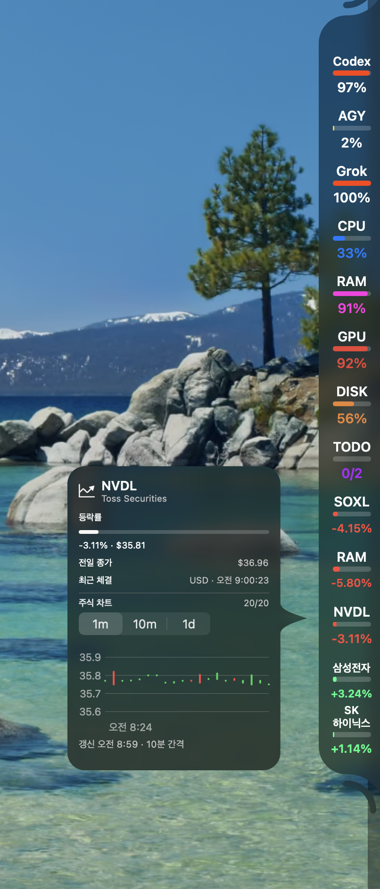

<div align="center">


[한국어](README.ko.md) · English

[](https://github.com/pmh10401/PenguinNotch/actions/workflows/ci.yml)


**PenguinNotch (Penguin Notch)** — A macOS app that pins a small black notch to a screen edge, showing how much
of each coding assistant's usage limit you have burned — and whether it is
still working, done, or waiting on you.**

<a href="docs/design/penguinnotch-stocks.png"></a>

Screenshot from PenguinNotch. Usage and prices reflect the capture time; click for full size.

</div>

Hover a ring for its limit windows and when they reset. Claude's ring shows the
same **current session** window Claude Code's own `/usage` leads with, so the
two never disagree.

## Download

[](../../releases)

That button opens Releases. For now, select the preview release and the disk
image whose commit ID matches its title. A signed and notarized release has
not been published yet.

To try unreleased `main` without an Xcode install, the [preview
build](../../releases/tag/preview) is rebuilt from every commit, and the
Package workflow keeps a per-commit disk image on each of its
[runs](../../actions/workflows/package.yml). Neither is notarized — they are
ad-hoc signed because CI has no Developer ID certificate — so
macOS quarantines the download. Clear the flag once, after dragging the app to
Applications:

```sh
xattr -dr com.apple.quarantine /Applications/PenguinNotch.app
```

If macOS says the app is *damaged*, that is the quarantine flag rather than a bad download — run the command above.

Universal binary. macOS 15 or later. To build and install a copy from source
instead, see [Building](#building).

## Windows

[](../../actions/workflows/windows-package.yml)

A Windows port — Rust/Tauri 2, same design and providers — lives in [`windows/`](windows/README.md).
Until a stable release is published, the button opens the Windows Package runs;
download the installer artifact from the run for the commit you want. Stable releases
use `PenguinNotch-Setup.exe`. It installs for the current user without administrator rights,
and fetches WebView2 if Windows does not already have it.

The installer is not code-signed, so the first time it runs SmartScreen says *Windows protected
your PC*. Choose **More info**, then **Run anyway**. Every Windows change also leaves an
installer on its [Windows Package run](../../actions/workflows/windows-package.yml).

## Connect your phone

The companion phone app (iOS and Android) can show the same usage
percentages, reset times and session states as the notch on your Mac.
It reads only what the notch already displays — never tokens, credentials
or raw API responses.

To pair, open **Settings › Phone › Connect a Phone…** (or the menu item)
on your Mac. A QR code appears with a five-minute countdown; scan it with
the companion phone app, or copy the link and paste it into the app. The
Mac and phone must be on the same Wi-Fi network — the server answers only
local-network addresses and rejects anything routed over the internet.

Each code is single-use and expires after five minutes. Reopening the
window always mints a fresh one.

To remove a paired phone, open **Settings › Phone**, find the device in
the list and click **Remove**. Its credentials are deleted immediately and
any subsequent request from that phone is rejected.

See [docs/phone-link-protocol.md](docs/phone-link-protocol.md) for the
wire-level details.

## What it reads

| Provider | Source | How |
|---|---|---|
| **Claude Code** | official | Claude Desktop's own cached usage response, where Desktop is running and signed into the same account. Then Claude Code's own `/usage`, asked of the installed `claude`. Then the OAuth token in the login keychain, against the endpoint that command uses. |
| **Cursor** | official | The editor's signed-in session in its local SQLite state, or the `cursor-agent` login in the keychain — no separate sign-in. |
| **Codex** | official | Using the local Codex sign-in. Shows the 5-hour and weekly limits when available, plus extra limit windows when the account has them. |
| **DeepSeek Platform** | derived from official Platform responses | Explicit sign-in in PenguinNotch's own WKWebView, then the Platform account summary and API-key/model usage endpoints. Shows funded/spent balance, 30-day tokens/cost, requests and API-key count. |
| **Antigravity** | official where licensed, otherwise a request count | Antigravity's local language server first, then Google's quota endpoint; a plain count when neither will answer for the account. |
| **GLM** | official | Z.ai's Coding Plan monitor endpoint, with a key borrowed from whichever coding tool already holds one — Claude Code's `settings.json`, ZCode, or OpenCode. |
| **MiniMax** | official where a Coding Plan key is used, derived from official Platform responses for the in-app sign-in | A Coding Plan key pasted in Settings, or explicit sign-in in PenguinNotch's own WKWebView. |
| **QianwenAI** | derived from official console responses | Explicit sign-in in PenguinNotch's own WKWebView, then the console's own Token Plan gateway. Shows the personal plan's 7-day credits window. |
| **Ollama (Local)** | local runtime | Automatically detected local models, RAM/VRAM, unload time and context. Optional response capture adds thinking and generation speed. |
| **LM Studio** | local runtime | Loaded models from LM Studio's own listing, what each one is doing (prompt, generating, queue) from its SDK socket, and speed, context use and tokens per day from its server log. No relay needed. |
| **Grok** | official | The Grok CLI session in `~/.grok/auth.json`, against the same credits billing endpoint `/usage` uses. |
| **OpenCode** | official | The Go plan's official usage endpoint, with the `opencode-go` key OpenCode itself stores on sign-in. |
| **Command Code** | official | The GOAT plan's `/alpha` billing endpoints, with the key the Command Code app writes to `~/.commandcode/auth.json`. |
| **GitHub Copilot** | official | GitHub's Copilot quota endpoint, authenticated with the GitHub CLI session already on the Mac (`gh auth login`). |
| **Kimi** | official | The Kimi Code CLI session in `~/.kimi-code/credentials/kimi-code.json`, against the same `/usages` endpoint the CLI's `/usage` asks. Shows the 5-hour rate window and the weekly quota. |
| **Kiro** | official | The kiro-cli session already on this Mac, against the same `/usage` that command prints. Shows monthly credits. |
| **Amp** | official subscription percentages; derived free-allowance percentage | The Amp CLI login in `~/.local/share/amp/secrets.json`, against Amp's `userDisplayBalanceInfo` endpoint. Shows Agent and Orb usage, or the Free allowance and replenishment rate. See [Amp details](docs/providers/amp.md). |

Most providers borrow a credential or session from a tool already on your Mac.
DeepSeek is the explicit browser-login exception: it never reads a browser's
cookies or credentials, and only makes requests after you choose **Sign in to
DeepSeek** from PenguinNotch. MiniMax is the same kind of exception — a key you
paste in Settings, or an explicit WKWebView sign-in. QianwenAI is a third: it
publishes no usage API and has no key to paste, so that WKWebView session is the
only way in. None of them opens a browser's cookie store.

Ollama Cloud accepts an API key in Settings. Switching a provider off stops its
usage polling and forgets its readings; borrowed accounts stay signed in to
the tools that own them.

**Local Ollama is detected automatically.** Configure its address or stop monitoring in **Settings → Ollama**.
Each loaded model gets a notch cell; reorder or hide it in **Settings → AI subscriptions**.
Hover for RAM/VRAM, unload time, context limit and quantization.

For generation speed (**tok/s**) and live **Thinking**, enable **Measure speed and thinking**
in Settings → Ollama, keep PenguinNotch open and connect through its local relay:

```sh
OLLAMA_HOST=http://127.0.0.1:11435 ollama run gemma4:e4b --think
```

Speed updates after completed native Ollama responses; thinking requires streamed
reasoning. Direct requests to Ollama's default port (`11434`) only provide model
detection. Monitoring never initiates inference or saves prompts, reasoning or replies.
See [Ollama details](docs/plans/2026-09-07-local-llm-provider-plan.md).

**Local LM Studio is detected automatically** on the port LM Studio's own settings name
(1234 unless you moved it). Configure the address or stop monitoring in **Settings → LM Studio**.
Each loaded language model gets a notch cell; embedding models are left out. The cell shows the
last response's **tok/s** and its ring fills with how much of the loaded **context** the last
request used. A white arc turns while the model reads a prompt or generates, and becomes a ring
of dots when requests are queued behind it. Hover for context used, tokens and requests today,
reasoning share, speculative-decoding acceptance, model size, quantization and context limit.

Nothing has to be pointed at PenguinNotch: what a model is doing comes from LM Studio's SDK socket
on the same port (the one `lms ps` uses), and speed and tokens come from `~/.lmstudio/server-logs`,
which LM Studio writes for every request from any client. Only counts and timings are read from
those files, never a prompt or a reply. Responses through the OpenAI-compatible endpoint carry no
clock, so their speed is timed from the generating phase and marked `~`. If LM Studio's server is
set to require an API token, paste one in Settings → LM Studio (or export `LM_API_TOKEN`); without
one, requests are sent with no Authorization header at all.
See [LM Studio details](docs/plans/2026-09-10-lm-studio-provider-plan.md).

Settings lists the connected providers in the order the notch draws them, and
you can drag one by its handle to move it. The order is remembered across
launches. A provider you switch back on joins the end of that list rather than
reclaiming an older position, so nothing you cannot currently see jumps ahead
of something you placed deliberately.

It also answers **"is it still working?"** — a thin arc spins inside a
provider's ring while a session is busy, and becomes a pulsing amber ring when
one is blocked waiting on you. Hover for every live session by name, where it
is running, and what it wants.

Two Claude Code logins are two rings. Anyone who keeps a work account apart with
`CLAUDE_CONFIG_DIR=~/.claude-work claude` gets a **Claude (work)** ring beside the
personal one, with its own limits, its own sessions and its own row in Settings.
Any `~/.claude-<slug>` directory Claude Code has run against is found at launch;
the default `~/.claude` always comes first, the rest in alphabetical order, so the
rings never swap places.

Codex accounts work the same way: `~/.codex` stays the **Codex** ring, and each
used `~/.codex-<slug>` directory adds a **Codex (slug)** ring with its own limits,
activity and Settings row. Profiles are discovered at launch, default first,
then alphabetically. To connect a second account, sign in through Codex CLI
using a separate home directory:

```sh
mkdir -p "$HOME/.codex-work"
CODEX_HOME="$HOME/.codex-work" codex -c 'cli_auth_credentials_store="file"' login
```

Choose the second account during sign-in, then restart PenguinNotch. Run that
account's CLI sessions with `CODEX_HOME="$HOME/.codex-work" codex` as well.
Repeat with another name, such as `.codex-personal`, for more accounts.
Settings shows each account's email and profile directory; each ring can be
reordered or switched off independently. Switching one off forgets only its
PenguinNotch readings and leaves the Codex login intact.

PenguinNotch reads each profile's `auth.json`; keychain-only or API-key-only
logins cannot provide these ChatGPT account limits. It never copies, refreshes
or writes Codex credentials. If a login expires, use that profile's Codex CLI
to renew it. Directories outside the `~/.codex-<slug>` convention are not
discovered automatically, and adding a profile requires restarting PenguinNotch,
just as it does for Claude.

## When a session ends

The notch opens itself for five seconds when an agent stops working, or stops
to ask you something, and sounds the system alert. Clicking it while it is open
brings that session's application to the front.

The app, not the tab. A session publishes its pid and nothing else — no window,
no tab, no tty — so the app is found by walking up the process tree from the
agent to whatever launched it. Choosing the *tab* inside that app needs the
terminal's own scripting interface, and there is no general one: Terminal.app
and iTerm2 can match a tab by tty, Warp and Ghostty publish no scripting
dictionary at all. So the app is raised for everybody and the tooltip names the
session, which leaves the last hop one keystroke rather than working for two
terminals and silently doing nothing in a third.

Both halves switch off separately in Settings, because they fail differently:
the peek is no use behind a full-screen window, and the sound is no use in a
meeting. Each of the two events — finished, and waiting on you — picks its own
sound there, with a preview button beside it.

The sound is played as a file on the ordinary output rather than handed to
`NSSound` as a system alert. A system alert goes through the interface
sound-effects channel, which System Settings → Sound can switch off — and on a
Mac where it is off, `NSSound.play()` reports success and nothing is heard.

Only *leaving* busy counts. A question being answered is not a piece of work
ending, and a session whose file disappears mid-turn — which is what quitting
Claude Code looks like — is not announced at all, since there is no window left
to jump to. Nothing is announced from the first reading either: every session
already running at launch arrives with no history, and treating that as a
transition would ring once per open window on every start.

## Alerts

A provider's headline limit crossing **80%** — and reaching **100%** —
becomes a system notification: once per crossing, never repeated while it
stays crossed, and again only after the window has genuinely rolled over.
Each provider can be muted from its own row in Settings, and macOS permission
is asked on the first real alert rather than at launch.

## Settings by task

The macOS sidebar separates **AI subscriptions**, **Stocks**, **Computer monitoring**,
**Daily widgets**, and **Appearance**. Stocks, computer monitoring and daily widgets
have their own visibility and color controls. Stocks starts with one quote-provider choice
and keeps API credentials collapsed until needed; AI usage formatting and thresholds live with AI accounts. App language, accent
color and Dock/menu-bar settings are under **General**.

Under **Appearance → Notch items and order → Manage visible items and order**, filter
by category or choose **Group by category** to gather related cells. Filtering and moving
rows preserves other categories’ positions; existing visibility, colors and order are kept.

## Placement

The notch lives on any of the four screen edges. Right and left keep a
vertical column; top and bottom lay the readings out side by side. It pins
itself to the physical screen edge, so showing or hiding the Dock does not
move it. Hold Option and drag to move along the selected edge; each edge
remembers its position. On a Mac with a hardware notch, the top
placement takes its exact shape, so the two read as one rather than as a bar
parked underneath it.

Along that edge it sits wherever you put it: hold ⌥ and drag the notch to
slide it, and each edge remembers where you left it, so moving the notch to the
top and back does not lose the place you chose on the right. **Recentre** in
Settings → Appearance puts the current edge back in the middle.

**Size** in the same place draws the whole notch — rings, text, tooltip and all
— smaller or larger. Medium is the size it was designed at.

At rest it is a small pill on the screen edge that unfolds when the pointer
reaches it — configurable in Settings to always show, or to hide entirely.
Settings live in an orb below the notch: an arc at rest, a gear on hover.

Clicking the notch while it is open keeps it open, so it stays put while you
read it; clicking it again lets it fold away as usual. That click has to land
on the body itself, since a ring takes its own click to refetch that provider
and the orb takes one to open Settings. Right-clicking offers the same thing as
a menu item, **Keep open**, ticked while the notch is being held open, which is
the surer way to release one that was kept open by accident. The item is
greyed out when Settings says Always show, because that choice is Settings' to
change.

In Settings → AI subscriptions → Usage display → Reset time, choose **Time remaining** for countdowns
like "Resets in 3 Days 3h". **Reset date** keeps the reset date and time, with
minutes shown when less than an hour remains.

General carries the app's accent colour. The device accent is the
default; fixed presets are available for pink, red, orange, yellow, green,
teal, blue, indigo, purple and off-white.

The app itself can show a Dock icon, a menu bar item, or neither. The menu bar
item is the PenguinNotch icon until you switch on **Show limit information in
menu bar** under Settings → General → App; then it shows the five-hour
limits of the providers you choose there — the provider's mark, the share used
and the time until it resets, like `72% · 2h 18m | 41% · 4h 05m`. Choosing
what the bar shows never changes what PenguinNotch reads, and with nothing chosen
the icon comes back. Its menu has the full readings either way.

## System usage (local development)

The macOS notch, and the Windows notch, also show **CPU, RAM, GPU, DISK, NET, BAT and PWR** as seven cells,
refreshed about once a second. On macOS, **Settings → Computer monitoring** hides
the cells and stops sampling. These readings also work with no connected AI
accounts and do not trigger quota alerts or get saved to the usage archive.

Choose a separate colour for each meter in the same settings section. The
choice is saved and applies to its arc, label, value and tooltip bar regardless
of usage level. The reset arrow beside each palette restores automatic usage
colours for that meter. NET's arc shows the primary connection while its label
keeps the traffic rate; PWR has no percentage arc. BAT colours warn about low charge rather than
high usage, unless an explicit colour is selected.

- **CPU:** busy ticks across all logical cores between samples, from 0–100%.
  Hover for user/system shares, logical core count, macOS thermal pressure and uptime.
  A scrollable two-column grid shows each logical core's load, numbered from 1,
  using Mach processor ticks on the same sampling interval. The grid follows the
  CPU color setting. Initial readings, read failures and long gaps never invent 0%.
- **RAM:** anonymous memory minus purgeable pages, plus wired memory and the
  physical compressor footprint. File-backed cache is excluded. Hover for
  used/total capacity, wired and compressed memory, and swap used. These sizes
  are not a memory-pressure measurement.
- **GPU:** the busiest accelerator's driver-reported `Device Utilization %`.
  This IOKit statistic is undocumented and may be absent on other hardware or
  macOS versions; an unavailable reading is shown as `—`, never 0%.
  Hover also shows that same accelerator's renderer/tiler activity and in-use
  GPU memory when its driver exposes them. These are engine counters, not
  individual GPU core loads; per-core GPU load is unavailable.
- **DISK:** used space on the volume containing the home directory, based on
  total capacity minus currently available capacity. APFS purgeable space can
  make this differ from Finder. Hover also shows free space and the OS's
  available-for-important-files estimate, which can include reclaimable space.
  This measures capacity, not disk I/O speed.
- **NET:** total receive + send throughput on active `en*` Ethernet/Wi-Fi
  interfaces. Hover for separate download and upload rates in decimal B/s,
  KB/s and MB/s. Loopback, VPN, bridge and AirDrop interfaces are excluded to
  avoid counting the same traffic twice. The compact cell uses K/M/G per second.
  The primary IPv4 connection (or IPv6 when no recognized IPv4 connection is
  available) determines the arc: **Ethernet fills the circle; Wi-Fi uses RSSI**.
  The Wi-Fi arc is a relative scale from -90 to -50 dBm, not a bandwidth
  percentage. Unknown signal/VPN routes leave the arc unmeasured; no primary
  connection leaves it empty. A filled Ethernet circle confirms the local
  connection, not Internet reachability. Hover shows the connection, measured
  RSSI/noise margin, negotiated Wi-Fi link rate, and bytes received/sent during
  this monitoring period. **Wi-Fi settings…** opens macOS Wi-Fi settings for
  network selection and connection management. No SSID, location permission,
  active network scan or automatic network changes are required.
- **BAT:** the internal battery's remaining percentage and a lightning mark
  while charging. Hover to distinguish charging, fully charged, external power
  without charging, and battery power. This uses Apple's
  [IOPowerSources API](https://developer.apple.com/documentation/iokit/iopowersources_h).
  The card also shows the OS's estimated remaining/full-charge time, reported
  battery condition and Low Power Mode. Missing estimates say “Calculating…”;
  paused charging never gets an invented completion time.
- **PWR:** the latest system consumption reading in watts. The tooltip separates
  system load, adapter input and signed battery flow (charging or discharging).
  `AppleSmartBattery/PowerTelemetryData` publishes `SystemLoad`, `SystemPowerIn`
  and `BatteryPower` in milliwatts; this is an undocumented driver interface,
  also used by [macwatt](https://github.com/ytomasch/macwatt/blob/main/macwatt.py).
  Sensors may update much more slowly than the one-second display poll. This
  is power at the Mac, not wall-socket energy or charger rated wattage. Hover
  includes estimated Wh integrated over observed intervals and the measured
  duration. Missing battery or power data is shown as `—`; desktop Macs and some
  drivers may not expose these readings. Inconsistent power-source or flow
  values are withheld while telemetry catches up with a charger transition.

CPU and network begin with `—` while establishing a baseline. Sleep/wake,
counter resets and newly connected interfaces establish fresh baselines.
CPU, GPU and PWR cards include averages/peaks of available samples from the
last 60 seconds. History and cumulative traffic/energy stay in memory for the
current sampling period and reset when monitoring is turned off. Waking from
sleep keeps those totals and the cells already on screen. A gap longer than
ten seconds, including sleep, is not billed and drops the 60-second trend.
Missing power readings are not integrated.
Collection uses native APIs on a background actor without shell processes,
administrator privileges, or additional dependencies.

## Calendar, weather, today's to-do and notch order

**Settings → Appearance → Notch items and order** controls which cells appear.
The calendar shows today's date; hover for a month grid, previous/next month,
Today, and a button to open the Mac's Calendar app. It follows the Mac's calendar
and week-start setting and does not read personal calendar events.
Select a date to see its distance from today, then **Copy date** to copy
`YYYY-MM-DD`. Week number and days remaining in the year are also shown; day
counts use calendar days so daylight-saving changes do not shift the answer.

Search for a city and select a result to enable weather readings. The cell shows
the current temperature in Celsius and a weather icon. Hover for daily low/high,
rain probability, feels-like temperature, humidity, wind in m/s, today's UV
peak, sunrise/sunset and the measurement time. A complete six-hour forecast adds
peak precipitation probability and, at 50% or above, the hour ending at that
peak. This is an hourly rain/snow probability, not an exact rain-start alert.
Times use the selected city's time zone. Data comes from
[Open-Meteo](https://open-meteo.com/en/docs), with city search from
[GeoNames through Open-Meteo](https://open-meteo.com/en/docs/geocoding-api).
Requests run every 15 minutes and after wake; clicking the cell also refreshes.
No API key or device-location permission is needed. A failed request keeps the
last reading marked stale; an unavailable initial reading shows a dash. Old daily
forecasts disappear when the date changes in the selected city's time zone.
To include the opt-in live city-search/forecast test, run
`TEST_RUNNER_PENGUINNOTCH_LIVE_WEATHER_TEST=1 make test-ci`; ordinary tests skip it.

**Stocks** shows the last trade for symbols you add under Settings → Stocks. Korean
codes such as `005930` and US tickers such as `AAPL` can share the list, up to
30. With Toss Securities selected, the current price comes from `GET /api/v1/prices`,
then later trades arrive on `wss://openapi-ws.tossinvest.com/ws/v1`. The client id and secret
are issued in Toss Securities WTS → Settings → Open API and are stored in the
Keychain. The same screen's allowed-IP list has to include this Mac. Each symbol is its own cell. Settings → Appearance → Meter style chooses circles
or horizontal bars for every cell, including accounts and system meters. A stock still
measures the move from the previous close, and 30 percent fills the circle or
the bar. A rise is green and a fall is red. The notch alternates the change and
last price every three seconds by default; set a 1–10 second interval under
Settings → Stocks → Notch quote display. If the previous close is unavailable,
the change shows `—` while the last price remains in the hover card. A quiet
market keeps the last price. The secret is never written to preferences.

Choose **one provider** under **Settings → Stocks → Quote provider**. Only the selected
provider’s settings and APIs are used; switching retains your watchlist and saved keys.
**Toss Securities** supports Korean and US quotes plus hover candlestick charts.
For free US quotes, choose **Finnhub**, [get your own API key](https://finnhub.io/register),
and save it in the macOS Keychain. US quotes use `GET /api/v1/quote` with the key in a
request header and refresh about once a minute per ticker. Finnhub mode does not call
Toss: Korean symbols stay in your list with an unsupported message, and candlestick
charts are unavailable. Select Toss again to restore those features. Existing provider
choices are retained; the default is Toss. Finnhub hover cards show quote details without
reserving an empty chart area. Finnhub plan limits and
[personal-use terms](https://finnhub.io/terms-of-service) apply; a missing or limited quote
never appears as a zero price.

Search by company name to add a Korean stock. Refresh the bundled
[KRX KIND listed-company directory](https://kind.krx.co.kr/corpgeneral/corpList.do?method=download)
with `python3 Scripts/update-krx-stocks.py`. Names are used for search and display;
the stored identity remains the stock code. Enter a code for ETFs, preferred shares,
and other instruments outside the company directory.


This original diagram explains the integration; it is not official Toss Securities artwork.
In Toss Securities WTS, open **Settings → Open API** to issue a Client ID and client secret,
then register this Mac's public IP in **Allowed IPs**. Enter both values under
**PenguinNotch Settings → Stocks**, select Toss Securities, expand the API-key section,
save the keys, and enable **Show stocks in notch**. Then add a Korean company name or
code (`005930`) or a US ticker
(`AAPL`, `SOXL`). The app stores the secret in the macOS Keychain, not preferences, and
uses market-data endpoints only; it does not place orders.

The app gets an OAuth token with `POST /oauth2/token`, batches current prices with
`GET /api/v1/prices`, then updates prices from realtime trade messages. Quotes
and charts reuse the same token: Toss invalidates the old token when a new one
is issued. An unauthorized request causes the app to renew it. Hover charts
request **1-minute** and **daily** candles from `GET /api/v1/candles`; the **10-minute**
view is aggregated locally from 1-minute candles. Choose 1–20 visible candles and the
default interval in Stocks settings. While the chart is open, the selected stock's
1-minute view refreshes every minute, its 10-minute view every 10 minutes, and its
daily view every 24 hours. Failed daily requests retry after 10 minutes. Switching
intervals loads only the needed source; 1-minute and 10-minute views share the same
minute candles. Realtime quotes refresh independently. See the official [Open API guide](https://developers.tossinvest.com/)
and [market-data reference](https://developers.tossinvest.com/docs/market-data).

**TODO** shows completed/total tasks and a completion ring. Hover to check or
reopen a task, add one through a native input dialog (up to 200 characters), or
delete it. **Undo delete** restores the most recently deleted item while the card
remains open. Unfinished tasks carry over; completed tasks leave today's list at
local midnight, with their records retained in local preferences. Tasks survive
app restarts and are stored only on this Mac, without calendar/reminder access
or cloud sync. Long lists scroll within the card.

Under **Appearance → Notch items and order**, use each row's switch to hide or
show AI accounts, individual local models, CPU, RAM, GPU, DISK, NET, BAT, PWR,
stocks, calendar, weather and TODO. Hidden rows remain in Settings so they can be shown
again. Visibility survives restarts, preserves colors, order, accounts and TODO
data, and applies to every display. Calendar/weather/TODO switches share their
existing enable settings. Individual system meters hide while collection stays
active; **Enable system monitoring** stops or resumes all system sampling and
temporarily disables the meter switches without clearing their choices.

Drag rows or use their up/down arrows to mix
AI accounts, individual local models, system meters, stocks, calendar, weather and TODO in any
order. The order is saved and applies to all displays and the menu. Temporarily
hidden widgets keep their saved slots when visible rows move. Existing
account-only reordering preserves the positions of the other widgets. Calendar,
weather and TODO also have individual colour palettes alongside the system meters.

## Origin and license

PenguinNotch is based on [vinzdg's Codenotch](https://github.com/vinzdg/codenotch).
The original copyright notice and MIT license remain in [LICENSE](LICENSE).
The Windows port's copyright notice remains in [windows/LICENSE](windows/LICENSE).
The new icon and features were developed in this repository.

## Updates

PenguinNotch uses [Sparkle](https://sparkle-project.org) to check
[this repository's releases](https://github.com/pmh10401/PenguinNotch/releases) for updates.
Sparkle checks daily
and installs in the background without prompting; Settings says so and can
switch it off. Every update is EdDSA-signed, so nothing installs that wasn't
built and signed by this fork's maintainer. Automatic updates become available
after a signed release with `appcast.xml` is published; preview builds do not
provide that guarantee.

## Building

```sh
brew install xcodegen   # once
make run                # generate and launch PenguinNotch Dev
make test               # unit tests
make install            # install PenguinNotch, then trash the intermediate Release app
```

No signing identity is required for `make run` or `make test`. `make release` — which archives,
notarizes, and produces a signed auto-update feed — needs a Developer ID
certificate and a notarytool keychain profile, and is only ever run by
the maintainer to cut an official release. See
[CONTRIBUTING.md](CONTRIBUTING.md). CI runs the same unit tests unsigned via
`make test-ci`.

A Debug build is ad-hoc signed, which means it has no stable code identity, so
macOS cannot match it to a saved keychain "Always Allow" — the prompt to read a
tool's token returns on every launch. To make the grant stick during local
development, sign the built app with a stable self-signed identity:

```sh
Scripts/sign-local.sh   # signs /Applications/PenguinNotch.app (pass a path to override)
```

It creates a reusable `PenguinNotch Local Signing` certificate in your login
keychain (no Apple Developer account needed) and re-signs the app. Grant the
keychain prompt once more after signing; it will not ask again.

Run with `PENGUINNOTCH_DEMO=1` to see fixed sample data instead of live readings.

## Architecture

Every provider implements `UsageProvider` (`Sources/Providers/`) and declares
its own `Fidelity` — `.official`, `.derived`, or `.manual` — so the UI never
presents a guess as if a vendor had published it. `UsageStore`
(`Sources/Model/`) polls them on a timer, keeps the last good reading across
launches, and degrades every failure to a visible status rather than a
made-up percentage.

The notch itself works in one-dimensional **stack space** (`along`/`across`)
regardless of which screen edge it's on; `NotchPlacement` is the only place
that maps that back onto real screen coordinates. `NotchLayout` holds every
measurement, quoted from `docs/design/frame-124-hover-tooltip.png` so the
layout can be checked against the design frame directly.

- Design spec: [`docs/specs/2026-08-28-usage-notch-design.md`](docs/specs/2026-08-28-usage-notch-design.md)
- Implementation history: [`TASKS.md`](TASKS.md)

## The honest caveat

No vendor publishes a clean "your session limit is N% used" API for any of
these tools. Each adapter reads whatever the owning app itself reads from —
an internal endpoint, a local database, a language server's own RPC — and
those can change without notice. Every adapter's response shape is pinned by
tests, and every failure degrades to a visible status (`stale`, `needsAuth`,
`error`) rather than an invented number.

**Claude Desktop's cache:** Claude Desktop is a Chromium app, so the usage
response its own panel draws is written to an HTTP cache file under
`~/Library/Application Support/Claude`. Reading it is how the ring stays right
for people who work in Desktop rather than in the terminal — the two Claude
Code paths below both go dark when `claude "/usage"` stops printing the windows
and the keychain token has not been re-minted since Claude Code last ran, which
is an ordinary state for a Desktop user. It is strictly read-only, and narrow:
only entries whose cached URL is *this account's* `/api/organizations/<id>/usage`
are opened at all, matched on the organization Claude Code records for the
profile, so one account's numbers can never land on another's ring. No token, no
cookie, no credential and no request to Anthropic are involved. A snapshot older
than 30 minutes is not shown as live — it drops through to the paths below, and
the last good reading ages and dims as any other would. Chromium's cache format
is private and may change; if it does, the source goes quiet and the existing
ones take over. Bodies are `content-encoding: zstd` and macOS ships no decoder,
so a decode-only build of Zstandard is vendored under
[`Sources/Vendor/zstd`](Sources/Vendor/zstd) (BSD-3-Clause).

**Keychain:** Claude's readings do not use it where Claude Code is installed.
Claude Code files a *new* keychain item on every token rotation, and the new
item's access list does not carry this app, so an "Always Allow" granted
against the old one stops working about an hour later — asking `claude` itself
avoids the question entirely. Where the keychain is still the source (no
Claude Code on the machine, or Antigravity), the app is signed with a stable
Developer ID identity so a grant survives rebuilds, and the secret is read
only when the owning app has actually changed it — checked via the item's
modification date, which isn't behind the same access prompt as the
credential — so a valid grant does not mean a prompt on every poll.

**Rate limits:** Claude's endpoint returns 429 if polled too hard, with an
unhelpful `Retry-After: 0`. The back-off treats that as a floor-raiser only —
60s, doubling per consecutive 429, capped at 15 minutes — and the deadline is
persisted, so relaunching during a penalty waits instead of spending an
attempt on it. Polling drops to every 5 minutes when nothing is running, and
right-clicking the notch offers **Refresh now**.

**Logs:** the app has no window, so anything worth diagnosing goes to the
unified log.

```sh
/usr/bin/log stream --predicate 'subsystem == "com.vinz.penguinnotch"' --level debug
```

## Contributing

See [CONTRIBUTING.md](CONTRIBUTING.md).

## License

[MIT](LICENSE) © 2026 Vinz
